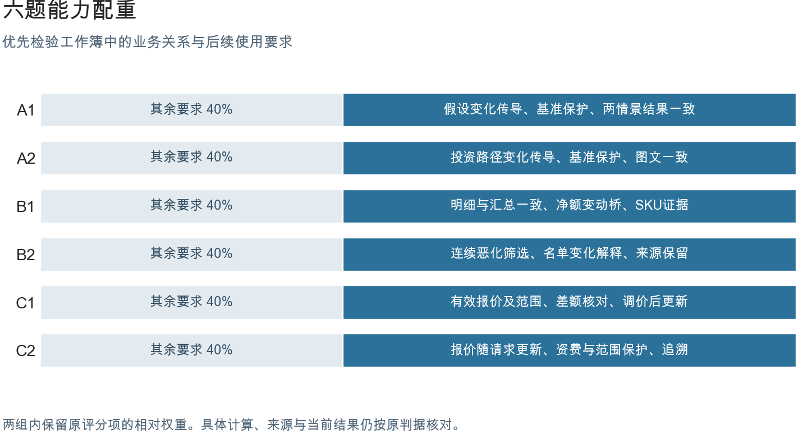

# NEW6 · 可核对、可继续使用的工作簿

NEW6检验Agent能否把真实材料中的业务关系保留到可交接的工作簿中。单个数字正确、筛选成功或表格可打开，是完成工作的必要条件；六题进一步要求计算链、分析范围和文档规则相互一致，让下游能够核对结果，并按题目要求继续使用。

前一批15题较难同时稳定满足场景真实性、能力覆盖与评测要求，因此NEW6重新选择六类业务材料设计任务。公开模型、交易、统计发布和价目文档提供原始事实，项目重构具体工作请求。六题分别覆盖专业计算、完整分析和文档规则应用。

## 三轨能力

A轨检验专业模型中的关系是否成立。A1把年度经营预测接到再投资、现金流和估值，A2把投资路径逐年传到资本和GDP。核验既看每期数值，也改变题目指定的输入，检查依赖结果是否正确更新、基准与无关部分是否保留。它测的是能继续工作的计算模型。

B轨检验分析是否覆盖完整对象，并在明细、汇总、图表和结论之间保持同一口径。B1核对销售、贷项、发票和SKU对两月净额的贡献；B2核对三期发布中的地区身份、连续恶化名单与名单变化解释。正确静态分析可以满足要求，关键在范围完整、口径一致和证据可追溯。

C轨检验源文规则是否被正确落实。C1需要分清有效报价、替换范围和未批准选项，再形成可调节的成本链；C2需要保留服务、重量上界与分区规则，正确计算寄件报价。字段抽取只是起点，限定条件还必须约束计算；适用任务还要在输入变化后给出正确更新。

三轨的共性是可核对、可交接。持续使用包括两种具体需求：沿已有明细和来源复核分析，以及修改明确允许编辑的输入后得到新结果。是否要求自动更新取决于任务，不能把所有重点能力都归为动态能力。

## 六题与人工审查

| 题 | 业务 | 当前题面 | 输入与版本 |
|---|---|---|---|
| A1 | [Amazon估值模型恢复](docs/BUSINESS.md) | [题面](tasks/52/NEW6-A-FIN-RESTORE-001/instruction.md) | [来源](tasks/52/NEW6-A-FIN-RESTORE-001/metadata/source_manifest.json) · [版本](tasks/52/NEW6-A-FIN-RESTORE-001/metadata/release_identity.json) |
| A2 | [LTGM长期增长情景](docs/BUSINESS.md) | [题面](tasks/54/NEW6-A-MACRO-SCENARIO-001/instruction.md) | [来源](tasks/54/NEW6-A-MACRO-SCENARIO-001/metadata/source_manifest.json) · [版本](tasks/54/NEW6-A-MACRO-SCENARIO-001/metadata/release_identity.json) |
| B1 | [零售月结与月度变化](docs/BUSINESS.md) | [题面](tasks/44/NEW6-B-RETAIL-CLOSE-001/instruction.md) | [来源](tasks/44/NEW6-B-RETAIL-CLOSE-001/metadata/source_manifest.json) · [版本](tasks/44/NEW6-B-RETAIL-CLOSE-001/metadata/release_identity.json) |
| B2 | [三期地方劳动力简报](docs/BUSINESS.md) | [题面](tasks/92/NEW6-B-LABOUR-BRIEF-001/instruction.md) | [来源](tasks/92/NEW6-B-LABOUR-BRIEF-001/metadata/source_manifest.json) · [版本](tasks/92/NEW6-B-LABOUR-BRIEF-001/metadata/release_identity.json) |
| C1 | [工程估算与修订往来](docs/BUSINESS.md) | [题面](tasks/23/NEW6-C-COST-WORKPAPER-001/instruction.md) | [来源](tasks/23/NEW6-C-COST-WORKPAPER-001/metadata/source_manifest.json) · [版本](tasks/23/NEW6-C-COST-WORKPAPER-001/metadata/release_identity.json) |
| C2 | [邮政资费与可更新报价](docs/BUSINESS.md) | [题面](tasks/49/NEW6-C-PARCEL-TARIFF-001/instruction.md) | [来源](tasks/49/NEW6-C-PARCEL-TARIFF-001/metadata/source_manifest.json) · [版本](tasks/49/NEW6-C-PARCEL-TARIFF-001/metadata/release_identity.json) |

[从这里开始人工审查](review/README.md)：每题一张窄表，先看材料，再填写文件或单元格、问题与返修结果。

## 当前得分

| 任务 | GPT-5.6 sol | Opus 5 | Qwen 3.8 |
|---|---|---|---|
| A1 Amazon估值模型 | — | 0.6259（n=1） | — |
| A2 长期增长情景 | 0.9940（n=2） | 0.3048（n=2） | — |
| B1 零售净额与贡献 | — | — | — |
| B2 三期劳动力分析 | 0.8968（n=5） | 0.5616（n=1） | — |
| C1 工程报价与成本修订 | 0.8912（n=8） | — | — |
| C2 邮政资费与报价 | 0.9465（n=5） | 0.5495（n=3） | 0.4427（n=2） |

本表采用当前配重，n是本评分版本下已评分答卷数，也是均分分母；横线表示暂无同版分数。

[逐次分数、均分和Pass指标](results/weight-sensitivity-v1/README.md) · [完整状态与来源](results/weight-sensitivity-v1/SOURCE_NOTES.md) · [原固定结果归档](results/SUMMARY.md)

## 判分依据

权重优先分配给直接决定工作簿能否完成上述用途的业务关系。若只抄对当前数字，却漏掉净额贡献、连续恶化条件、报价替换关系或必要的输入联动，交付就难以继续使用。这些缺陷应影响主要得分；来源、基础计算和当前结果仍保留独立信用，合理的局部正确不会被整份抹掉。

当前计算将重点关系合计设为60%、其余要求设为40%，组内保持原评分项的相对权重。分数等于两组加权信用的加权和。这一分配体现业务重要性；比例本身不构成能力测量有效性的证明。证据来自判据与任务义务的对应，以及参考、合理等价实现和真实业务错误的差异。

核验案例要回答两个问题：保持业务含义但更换布局或公式，是否仍得到相应信用；明确遗漏或破坏某项业务关系，是否只在相关判据失分。六份参考均获得满分，43个选定案例断言通过，为当前判据提供了局部证据；完整测量有效性仍需人工审查与同版本真实样本共同核对。

业务判分采用确定性程序，未使用LLM Judge。程序负责100%的计分权重；LLM和视觉模型计分占比为0%。人工审查独立记录，不折算进自动分数。

判分顺序是：读取候选工作簿，绑定对象、字段、期间和单位；与独立答案及业务关系核对；检查题目要求的更新、完整性与保护；形成逐项信用，最后按60/40汇总。Python、openpyxl及Excel内部结构负责读取，适用的公式更新由固定LibreOffice环境在原件隔离副本上重算。

未舍入分数达到0.70即通过，没有额外hurdle或隐藏封顶。合理表名、布局和等价单位不扣分；缺少题面明确要求的结果、比较图、解释或来源，按对应已有判据失分。必要事实尚无法判断时保留待判，不计零、不缩小分母。

## 人工审查与离线核对

[逐题审查入口](review/README.md)提供六份可填写页面，覆盖请求、输入、参考、rubric、Judge公平性、下游可用性与难度证据。当前待人工审查，抽检量为0。外发第2—5节的差项见[要求核对表](review/REQUIREMENTS.md)。

[已有工作簿离线评分](repro/README.md)使用固定底层Judge，生成分项回执；[当前配重计算](results/weight-sensitivity-v1/README.md)从这些分项信用计算本页分数。两步都不启动新的做题Agent，原始分项和原分保留。

## 完整材料

[完整六题、输入、参考与原答卷（需组内权限）](https://github.com/alex051107/excelbench-p15-results/tree/new6-final-review-20260906-v1/new6-final)。公开仓库提供说明与代码，受限第三方材料保留在既有私有仓库。基线题包标记为new6-final-review-20260906-v1；当前结果的来源与Judge提交逐次记录在结果附件。
