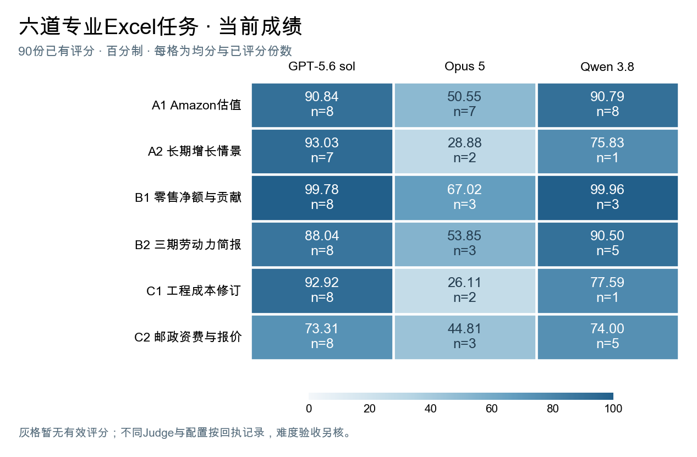

# 专业Excel任务：题包、最终成绩与人工审查

这里整理了六道专业Excel任务，以及旧15题的成绩对照。我们检查Agent能否读懂专业材料，把计算关系、分析口径和文档规则落实到可核对、可继续使用的工作簿中。A轨侧重计算模型，B轨侧重完整分析与口径一致，C轨侧重文档规则和计价；自动更新只在题目明确要求时检查。

**当前尚无足够证据确认有题目完成全部难度验收。** 邮政报价、财务对账、政策与排放是已有三系统评分中分数较低的三题；它们各自的样本、通过次数和未满足项见[当前筛选结论](results/FINAL_SELECTION.md)。

## 从这里开始

1. 在下表选一题，下载输入、参考和真实答卷。
2. 看[当前成绩与筛选结论](results/FINAL_SELECTION.md)，再按[统一复跑入口](repro/CURRENT_REPLAY.md)核对已有答卷。
3. 对照题面、答案和逐项回执，在[人工审查表](review/README.md)写下具体问题。

## 六题材料

| 任务 | 要交付的工作 | 题面、文件与人工审查 |
|---|---|---|
| A1 补全Amazon估值模型并比较情景 | 经营预测、现金流、估值与情景比较 | [直接进入A1](review/A1.md) |
| A2 计算投资路径对长期增长的影响 | 投资路径、资本、GDP与人均GDP | [直接进入A2](review/A2.md) |
| B1 核对零售月结并解释净额变化 | 两月净额变化、发票及SKU支撑 | [直接进入B1](review/B1.md) |
| B2 更新劳动力地区名单与分析简报 | 连续恶化名单、变化解释与证据 | [直接进入B2](review/B2.md) |
| C1 根据修订记录更新工程成本 | 有效报价、替换范围与可调节成本 | [直接进入C1](review/C1.md) |
| C2 按邮政资费规则计算寄件报价 | 价格网格、寄件报价与请求更新 | [直接进入C2](review/C2.md) |

每题页面直接展示题面，并提供全部输入ZIP、参考工作簿和一份随机抽取的真实Agent最终文件。[六题材料集中下载](materials/README.md)，无需私有仓库授权。

## 当前采用的成绩

六题共144个槽位，目前90份已评分。下表满分100，括号是已评分份数，也是均分分母。

|题目|GPT-5.6 sol|Opus 5|Qwen 3.8|
|---|---:|---:|---:|
|A1|90.84（8份）|50.55（7份）|90.79（8份）|
|A2|93.03（7份）|28.88（2份）|75.83（1份）|
|B1|99.78（8份）|67.02（3份）|99.96（3份）|
|B2|88.04（8份）|53.85（3份）|90.50（5份）|
|C1|92.92（8份）|26.11（2份）|77.59（1份）|
|C2|73.31（8份）|44.81（3份）|74.00（5份）|

图中每格是已有评分的均分与份数。千问43份最终文件已全部离线核对，其中23份出分、20份待判，另5槽尚无最终文件。已生成文件但运行有异常的情况单独标记，不据此认定为正常完成的难度样本。

[六题逐次成绩](results/current-effective-v3/README.md) · [千问43份逐次结果](results/qwen-final-20260906/README.md) · [旧15题结果](results/ability-comparison-360-v1/README.md) · [三道低分题与未满足要求](results/FINAL_SELECTION.md)

## 题包和复跑

[题包文件用途](docs/PACKAGE_CONTENTS.md)说明每个目录负责什么。`tasks/`已清理开发案例与试跑文件；`tests/`只保留实际判分依赖，指定校准案例放在独立的`validation/`。题面、输入、Judge判据和分数不因目录整理而改变。

- [环境准备与复评真实答卷](repro/CURRENT_REPLAY.md)
- [六题参考与校准入口](repro/README.md#六题参考与随包校准)
- [实际验证范围](repro/PUBLIC_VALIDATION.md)
- [外发要求与尚缺证据](review/REQUIREMENTS.md)

## 业务与判分说明

[各题业务背景](docs/BUSINESS.md) · [评分方法与精确配重](docs/JUDGE.md) · [Judge局限、论文依据与讨论问题](docs/REVIEW_BRIEF.md)

当前人工审查状态为待审查。材料、参考与实际答卷均可公开下载；参测时只提供题面和可见输入，不能将整份审查仓库挂载给Agent。
