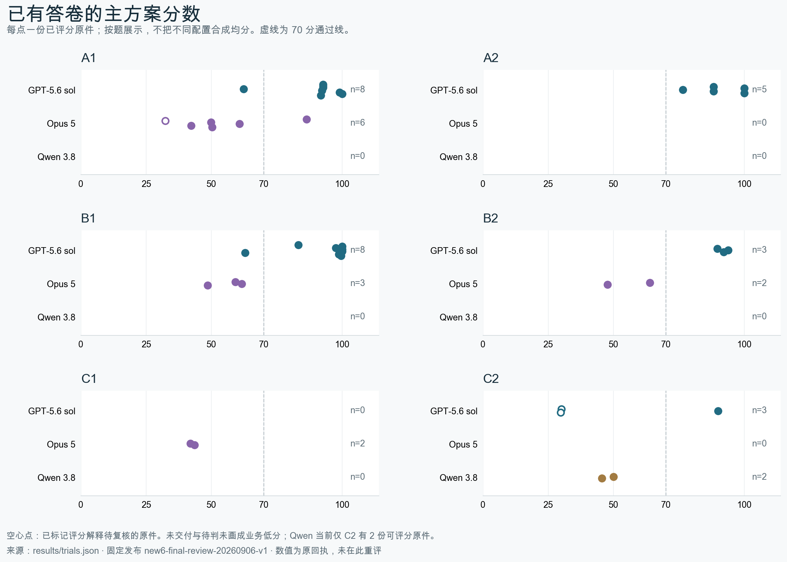

# NEW6 · 六道业务工作簿任务

NEW6 是在前一批15道题之后重新设计的六道业务题。前15题让我们看到了一个难点：真实场景、任务难度和可核对的评分要求，很难同时保持稳定。因此，这次重新选择了估值、经济增长、零售分析、劳动力统计、工程成本和邮政报价六类材料，把每题要完成的工作和要检验的能力放在一起设计。

六题沿用公开材料中的业务背景，工作请求和部分情景由项目重构。Agent拿到的是原始工作簿、交易、统计发布或PDF，需要交出下一位同事能够核对和继续使用的Excel。公开来源提供事实依据，项目编写的请求负责说明这次要做什么。
## 我们看重的能力

一般的表格操作会问：能否求和、筛选、查价或画图？NEW6继续追问：这些操作放到一份真实工作里，结果还能不能成立？例如，销售净额能否追到贷项和交易；报价能否正确处理重量上界；改了投资路径，后面十几年的资本和产出是否一起变化。

图按“接到什么工作—要完成哪些关系—怎样核对”展开。求和、读数和识别单位是基础；六题的重点在这些操作如何共同完成业务。动态更新只是其中一种检查方式，B类的静态分析同样需要判断。

[逐题业务与能力说明](docs/BUSINESS.md)提供具体对比、材料来源、正确交付和下游用途。

## 六题入口

| 题 | 业务 | 当前题面 | 输入与版本 |
|---|---|---|---|
| A1 | [Amazon估值模型恢复](docs/BUSINESS.md) | [题面](tasks/52/NEW6-A-FIN-RESTORE-001/instruction.md) | [来源](tasks/52/NEW6-A-FIN-RESTORE-001/metadata/source_manifest.json) · [版本](tasks/52/NEW6-A-FIN-RESTORE-001/metadata/release_identity.json) |
| A2 | [LTGM长期增长情景](docs/BUSINESS.md) | [题面](tasks/54/NEW6-A-MACRO-SCENARIO-001/instruction.md) | [来源](tasks/54/NEW6-A-MACRO-SCENARIO-001/metadata/source_manifest.json) · [版本](tasks/54/NEW6-A-MACRO-SCENARIO-001/metadata/release_identity.json) |
| B1 | [零售月结与月度变化](docs/BUSINESS.md) | [题面](tasks/44/NEW6-B-RETAIL-CLOSE-001/instruction.md) | [来源](tasks/44/NEW6-B-RETAIL-CLOSE-001/metadata/source_manifest.json) · [版本](tasks/44/NEW6-B-RETAIL-CLOSE-001/metadata/release_identity.json) |
| B2 | [三期地方劳动力简报](docs/BUSINESS.md) | [题面](tasks/92/NEW6-B-LABOUR-BRIEF-001/instruction.md) | [来源](tasks/92/NEW6-B-LABOUR-BRIEF-001/metadata/source_manifest.json) · [版本](tasks/92/NEW6-B-LABOUR-BRIEF-001/metadata/release_identity.json) |
| C1 | [工程估算与修订往来](docs/BUSINESS.md) | [题面](tasks/23/NEW6-C-COST-WORKPAPER-001/instruction.md) | [来源](tasks/23/NEW6-C-COST-WORKPAPER-001/metadata/source_manifest.json) · [版本](tasks/23/NEW6-C-COST-WORKPAPER-001/metadata/release_identity.json) |
| C2 | [邮政资费与可更新报价](docs/BUSINESS.md) | [题面](tasks/49/NEW6-C-PARCEL-TARIFF-001/instruction.md) | [来源](tasks/49/NEW6-C-PARCEL-TARIFF-001/metadata/source_manifest.json) · [版本](tasks/49/NEW6-C-PARCEL-TARIFF-001/metadata/release_identity.json) |

## 已有结果

在当前固定发布的已评分答卷中，GPT-5.6 sol 的结果整体更好：27份中23份达到70分；Opus 5 的13份中1份达到70分。Qwen 3.8 当前只有C2的2份可评分原件，分别为45.46分和50.00分。各系统的有效样本和任务覆盖不同，这里描述已有交付表现，正式难度核验仍按逐题、同版本与同配置进行。

| 题目 | GPT-5.6 sol | Opus 5 | Qwen 3.8 |
|---|---|---|---|
| A1 | 62.25–100.00（8份） | 32.30–86.44（6份） | 暂无可评分答卷 |
| A2 | 76.48–100.00（5份） | 暂无可评分答卷 | 暂无可评分答卷 |
| B1 | 62.84–100.00（8份） | 48.46–61.49（3份） | 暂无可评分答卷 |
| B2 | 89.63–93.86（3份） | 47.73–63.88（2份） | 暂无可评分答卷 |
| C1 | 暂无可评分答卷 | 41.97–43.55（2份） | 暂无可评分答卷 |
| C2 | 29.69–90.06（3份） | 暂无可评分答卷 | 45.46–50.00（2份） |

表中为已评分原件的最低—最高分，满分100，括号内为份数；只有一份时列单个分数。它展示已有分数跨度，不是均分或pass@8。未交付、待判和运行失败不进入这个范围；完整配置分组与均分见结果附件。

本次记录138个当前槽位，其中42份已评分、54份Judge待判、22次运行或基础设施失败、20次确认未交付；目标144槽位尚缺6条。确认未交付按冻结政策计零，待判和运行异常保留空分。已标记需要复核的分数保留原回执，不据此直接归因能力不足。

[完整配置分组成绩表](results/SUMMARY.md) · [逐次记录](results/trials.csv) · [逐项得失分](results/criteria.csv) · [另两套配重结果](results/alternate_profiles.csv)

图只展示已评分原件，不将未交付或待判画成业务低分。表格由同一份逐次记录生成，不混合不同配置的均分。是否通过采用未舍入 score≥0.70；pass@8 使用标准组合数定义，样本不足时留空。

## Judge 怎样评分

业务判分采用确定性程序，未使用LLM Judge。程序读取原工作簿，确定对象、字段、期间和单位，与独立答案核对，再检查题目要求的更新、完整性与保护，按固定权重汇总逐项信用。

[Judge流程、方法与边界](docs/JUDGE.md) · [逐项权重与代码位置](docs/METHODS.csv) · [实际配置](repro/JUDGE_CONFIG.json)

## 复跑与人工审查

[离线复跑命令](repro/README.md)覆盖参考、随包校准、已有原件和自有answer.xlsx。当前实际验证为参考六题各五次全部满分，42份已评分原件复评一致，校准17/18符合预期；具体结果见[验证记录](results/VALIDATION.md)。复跑不启动新的做题Agent。

[人工审查表](review/HUMAN_REVIEW.csv)按题记录具体文件或单元格、意见、返修和复核。当前为待人工审查，抽检量为0；[要求核对表](review/REQUIREMENTS.md)保留尚待确认的验收项。

## 完整材料与固定版本

六题和结果的固定标记为 `new6-final-review-20260906-v1`，Judge核心提交为 [31abf3fa03c3](https://github.com/alex051107/excelbench-p15-results/commit/31abf3fa03c358f6134600fe5b0416e6ee24211a)。本仓库main更新阅读说明和图示，固定题包与历史回执保留。

[完整六题、原始答卷与全部回执（需组内权限）](https://github.com/alex051107/excelbench-p15-results/tree/new6-final-review-20260906-v1/new6-final)。公开仓库是说明与代码审查入口，完整第三方输入和私有核验材料按授权范围放在既有私有结果仓库。
