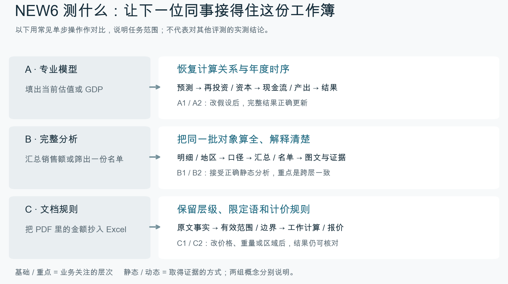

# 六题的业务与能力

NEW6关注一份工作簿交到下游后能否继续使用。填出正确数字是共同基础，数字对应的对象、期间、单位和来源也要明确。六题进一步要求恢复专业关系、把分析对象算全，或把文档中的限定条件落实到计算中。

这里的“常见单步操作”是阅读对照，用来解释六题增加了什么交付要求，不是对其他benchmark的实测评价。基础能力和重点能力描述业务关注，静态和动态描述取证方式。B1、B2用静态分析也能完成重要的口径判断与证据核对；A1、A2、C1、C2另有明确的后续调整要求。

六题使用真实公开材料，工作请求与部分情景由项目重构。逐题版本与输入身份见[发布清单](../release.json)，结果见[成绩表](../results/SUMMARY.md)。

## A1 · Amazon 估值模型恢复

每股价值只是估值的最后一个数字。A1要求交出它前面的年度预测、再投资和现金流关系，分析师才能在改变假设后检查整份估值，而不必从头重做模型。

使用者是复核 2018 年 9 月估值的分析师。他需要接好预测、现金流与估值计算，并说明审阅情景为什么偏离原基准。输入来自 Aswath Damodaran 的公开教学估值工作簿；审阅请求和情景是项目编写。原模型历史租赁融资循环中的一个输入，经独立计算后固定并向做题者披露，依据随包保存。

交付是一份能继续做增长率、经营利润率与折现率敏感性分析的工作簿。下游应能逐年核对收入、费用、再投资、自由现金流及终值，并在修改输入后得到更新的两套估值。正确答案还保留历史基础和解释两情景差额。

重点是年度关系、终值时点和完整估值桥。只抄一个每股价值会失去年度与更新事实的信用。错误的终值期间会把整个终值折现错位；静态填值即使当前金额正确，也无法满足后续情景审阅。本题按教学估值材料重构，交付用于核对计算与情景。

## A2 · LTGM 长期增长情景

投资何时改变，决定了资本和产出从哪一年开始受到影响。A2要核对这段年度递推。列出一组GDP再画趋势图，只完成了结果呈现。

使用者是比较长期投资路径的经济分析人员。材料来自世界银行 LTGM V4.42 教学工作簿及说明文件；Zambia 参数、缺失计算区和审阅情景由项目设置，不能写成世界银行预测。

Agent 要补齐 2019 至 2035 年的投资、资本、产出、增长及人均结果。基准要保留，图表和解释也要与计算一致。下游可以改投资目标与过渡年，核对年度变化是否逐年传到产出及图表。参考按独立递推重算，不靠候选表格的位置判断正确性。

重点是年度时序、投资过渡路径和资本到产出的依赖。用错一期资本、混淆 real GDP 与增长率、图表接到另一情景，都会误导情景比较。当前数值、更新响应、基础情景保护分别给部分信用。

## B1 · 零售月结与月度变化解释

十月销售额可以直接汇总出来，B1接着要回答它为什么比九月变化。完整交易、贷项、异常和SKU贡献必须对应同一组净额，经营人员才有依据追查原因。

使用者是负责 2011 年 10 月经营复盘的零售分析师。原始交易来自 UCI Online Retail，作者 Daqing Chen；项目按公开时间范围提取记录、增加来源行身份，并编写月结政策和比较要求。交易事实与项目政策分别保留。

交付要同时包括发票明细、国家与总体汇总、销售和贷项、异常记录、图文简报，以及 9 月到 10 月净记录额变化的贡献桥与 SKU 支撑表。下游沿来源行、发票身份和 SKU 追到汇总，核对包含、排除和未解决项。

月结首先要把对象算全。重复外观记录不能随意去重，贷项不能直接当普通销售，月度桥应与两端净额闭合，图文数字应与明细相符。本题接受正确的静态分析表。明细与汇总对不上，就无法解释收入变化。现有答卷的得失分会列在结果页；人工反例另列。

## B2 · 三期地方劳动力简报更新

B2关注连续两次变化。它要求比较三期发布，找全符合条件的地区，并说明它们为什么进入或退出名单；只从一期数据筛出失业率较高的地区，回答的是另一个问题。

使用者是维护英格兰地方政府劳动力简报的统计分析师。输入是 ONS 三期 LI01 正式发布及一份项目制作、可核对的旧简报。January 2023 版使用该发布页的更正替换文件，工作簿内部封面为 February 2023，比较期以原表实际期间为准。更新请求是项目重构。

Agent 需找出连续两次比较中失业上升且就业下降的最多五个地方政府，交出完整支撑数据、当前图表、解释和可复核的旧分析。下游要能核对地理身份、指标定义、排名与进出名单原因，分清数据不足和真正不满足筛选条件。

重点是完整可比对象、两段变化和新旧名单的一致。漏地区、混用累计变化、忽略公开精度、保留过时图表会改变会议判断。这题不要求动态公式。

## C1 · 工程估算与修订往来

金额抄对了，成本仍可能算错。C1需要先判断哪份报价有效、什么已包含、哪些选项未获批准，再按正确基数计算；把PDF金额逐项相加，可能重复计入原有暂列款。

使用者是会议中更新工程成本的造价人员。原始材料为 2024 年 10 月 Revision A 工程估算 PDF；修订往来由项目编写。原估算已包含 432,000 的供暖暂列款，当前报价为 458,000，早期 472,000 已作废；设计风险采用 12%，18,000 石棉选项未批准，需单列。金额的计价时点、范围与排除条件随原材料保留。

交付应并列原估算和当前成本，并列出替换关系、费用计算、差额调节及来源。下游在会议里改价格或费率，工作总额和调节应同步更新。独立答案核验保留原印刷数与工作重算数两种明确比较基准。

先弄清哪一份报价有效。随后才能按文档层级、限定语和计价规则计算。把新报价直接加到已含暂列款之上会重计；把未批准项目算入当前范围会扩大成本；冻结调节金额会掩盖后续变更。Judge 对这些事实分别给分，人工审查再核验材料语义和下游使用是否顺畅。

## C2 · 邮政资费与可更新报价

物流人员会继续改重量和分区。C2因此要求整理完整价格网格，标明重量上界和支持范围，让新请求沿相同规则得到报价。只查出当前几件包裹的价格，还不能支持后续使用。

使用者是给一批包裹选择服务的物流人员。材料是 USPS 2026 年 7 月 12 日生效的 Notice 123 页面；寄件请求和支持范围由项目编写。源价目表的重量上界、服务、分区和附注是原始事实，客户请求没有真实委托身份。

Agent 需交出可追溯的价格网格、每条请求的两项服务价格、较低价选项及批次合计。下游修改重量或区域后，应得到更新报价；超出支持范围的请求要明确标出。Judge 的独立机器版价格仅在私有核验侧使用，参测 Agent 只看到规定 PDF 和请求。

重点是多层表头、重量进位、范围限制和将规则用于新输入。用向下取整选择重量档、混淆服务表或分区，会给出错误收费；当前报价抄对但不能更新，仍会失去更新事实的信用。现有结果不代表所有 USPS 产品、附加费或未来价格版本均获验证。
