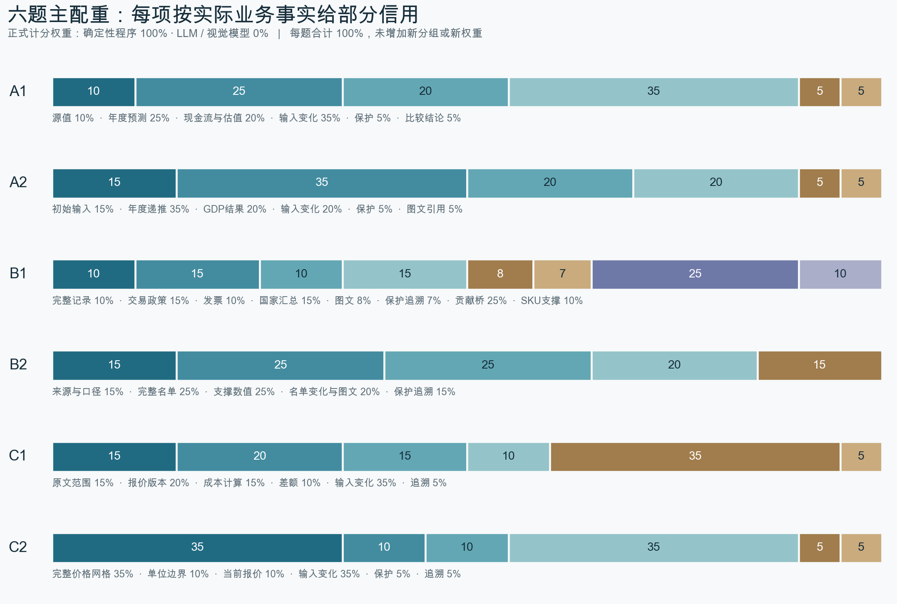

# 判分如何进行

本页记录基线题包的业务判据与原权重。当前展示口径保留这些分项事实，再按[能力配重](../results/weight-sensitivity-v1/weights.json)汇总；[逐次Judge身份和来源](../results/weight-sensitivity-v1/SOURCE_NOTES.md)随结果记录。

业务判分采用确定性程序，未使用LLM Judge。

读取器先回答“答案在哪里、代表什么”，Evaluator再回答“这些结果是否正确”。计分器只把已核对的事实按权重汇总。以B1为例，程序先确定九月、十月销售与贷项所在区域，再核对贡献桥是否等于两端净额差，保留各项实际值和核对依据。

做题系统是 Codex CLI、Claude Code 或 Qwen Code，它们负责操作输入并提交工作簿。Judge 使用 Python、OOXML/openpyxl 与固定版本 LibreOffice 读取和重算候选。人工审查者负责核验场景、独立答案、评分公平性与下游使用质量。这三个角色分开记录。

数值、记录身份、明确的计价规则和年度递推都有可独立复算的答案。确定性程序可以保留每个对象的实际值、预期值与得失分依据，避免把精确算术交给模型重复猜测。表头和标签匹配也是程序解析；嵌入式图表可按图表引用与缓存核对，未被支持的图片或合法表达应保留解析待判。没有调用视觉模型，也没有已配置的 Judge 模型 ID、provider、提示模板或付费一致性实验。

[实际配置](../repro/JUDGE_CONFIG.json)与[环境示例](../.env.example)只列已使用设置。离线容器断网，超时 600 秒，自动重试 0。元数据里的 JUDGE_ 字段说明这套固定设置；它们不承诺切换成 LLM 后仍获验证。

## Judge的比例与主配重

每题的正式计分权重均为确定性程序100%、LLM及视觉模型0%。这指的是评分方法占比，不是运行耗时占比，也不是对所有自由布局的识别成功率。人工审查独立记录，目前没有人工判定折算进正式reward。

图中每段对应原rubric的一项，数字是该项满分占比。各题没有统一的“基础/重点”百分比分栏；不能把所有动态检查简单称为重点能力。比如B1的贡献桥占25%，它可以通过正确的静态分析获得信用。

## 权重与部分信用

当前主方案为 `capability_first`，另外两套 `balanced` 与 `ongoing_use` 只作结果附件。每个方案使用相同事实向量。对第 i 项，Evaluator 按固定事实分母得到 0 到 1 的信用 fᵢ；分数为 Σ(wᵢ×fᵢ)/100。各方案正向权重均合计 100。逐项方法、权重和完整代码定位见[方法表](METHODS.csv)，事实分母、容差和声明的变化范围见每题 `metadata/frozen_rubric.json` 及其引用的判分契约。

当前没有独立负项、独立 hurdle 或隐藏封顶。适用保护义务通过正向事实项计分，未履行便失去该项信用。是否通过只取决于可评分状态下未舍入 score≥0.70；不能按展示时四舍五入的百分数判定。附件 Schema 的 0.6 是示例，本次沿用已确认的 0.70。

已确认运行与收集正常，但没有提交要求的工作簿时，保留 OUTPUT_MISSING、总分0和失败，并计入均分分母。确认无法打开的交付文件按冻结政策处理。这里不伪造逐项事实。供应商错误、收集失败、尚在运行和合法解析待判保持空分，不补零。所有汇总先看上游证据，再看 Judge 回执。

A 轨检查模型计算与适用的输入变化；B 轨检查完整对象、统计或交易口径，以及明细、汇总、图文和证据的一致；C 轨检查字段、层级、限定语、范围、计价及适用的报价更新。基础能力和重点能力是业务分组，不能用静态与动态替代。B1、B2 接受正确静态实现；A1、A2、C1、C2 对明确要求的后续更新单独检查。

## 合理实现与不能判断的情况

当前代码按语义标签、对象身份及数值关系读取，不以参考表固定坐标作为唯一合法答案；任务明确要求保留的源结构仍须保留。范围内的等价布局、公式和明确标注的比较基准可以获得信用。受支持范围以随包代码和实跑案例为准。识别不全、引擎不支持或无法确定绑定时，总分留空，并在回执中保留原因。

[校准入口](../repro/calibration.json)包含参考、等价实现、单项业务错误和必要边界。它们用于检查特定判据的区分能力，人工变造反例不计入 Agent 样本，也不用来排列模型强弱。五次一致性按同一版本实际回执计算逐项与总分样本标准差；没有回执的项保持空白。[验证记录](../results/VALIDATION.md)列出实跑结果和遗留问题。

人工复核仍需检查源文档语义、golden 是否正确、候选解释是否合理、代码未覆盖的视觉信息及下游可继续使用程度。程序校准通过不替代人工审查或难度验收。
