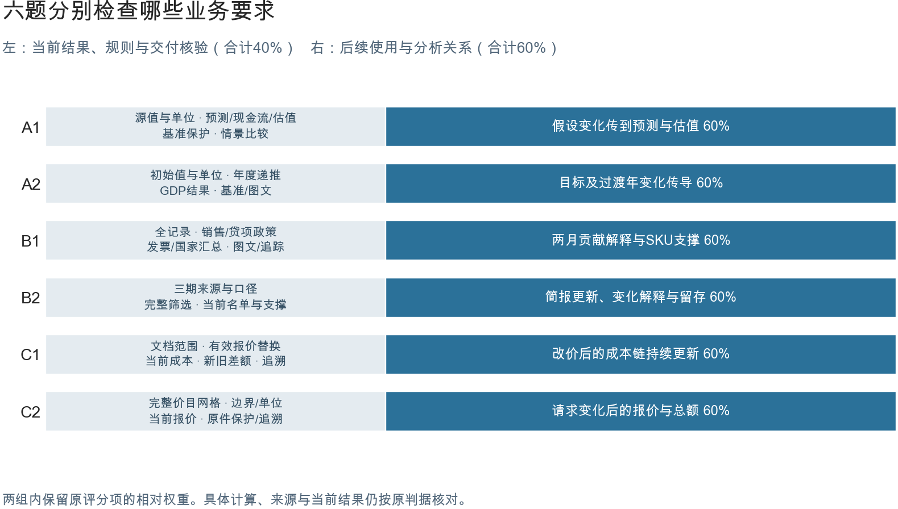
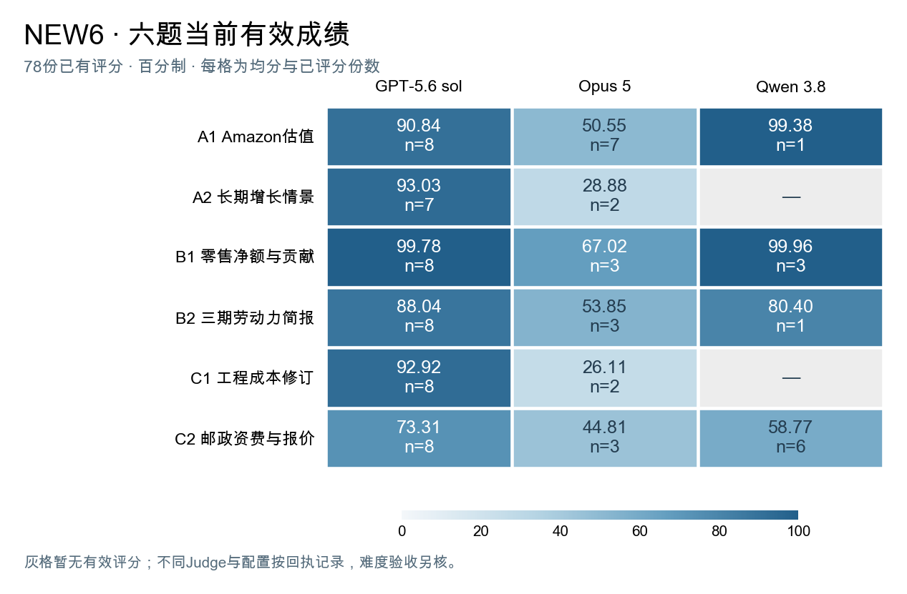

# 六道专业Excel任务：测量目标、现有结果与审查问题

**我们想验证：告诉Agent违反了哪条业务规则、证据在哪、哪些结果要跟着改，能否帮助它修好工作簿，并保留原本正确的内容。**

先用六道专业Excel任务检查Agent能否把业务做对。A轨看专业模型的计算关系和年度变化，B轨看完整分析与口径一致，C轨看文档条件、范围和计价规则。题目、真实答卷、参考和离线评分已经整理到公开仓库；修复反馈的对照实验还没有开展。

这次最需要大家帮忙定三件事：**Judge怎样接受合理布局、区分读取失败与业务错误；偏容易的题该增加什么真实要求；这些能力和修复研究相比已有工作是否值得继续做。** 下文先给材料与成绩，再用具体案例说明问题和待定规则。

## 六道题分别考什么

三轨共同检验工作簿能否交接给下一位使用者。下一位使用者应能找到结果对应的对象、期间、单位和依据；题面要求修改输入时，相关结果还应正确更新。A轨侧重专业计算关系，B轨侧重分析范围与证据一致，C轨侧重文档规则落实。动态更新是其中一种检查方式，B类正确的静态分析也可以完成工作。

| 题目 | 场景与材料 | 交付及主要能力 |
|---|---|---|
| [A1 Amazon估值](../review/A1.md) | 用公开估值模型与方法说明复核经营预测 | 连接年度预测、再投资、现金流和估值；修改假设后，预测与估值按同一计算链更新 |
| [A2 长期增长](../review/A2.md) | 用LTGM模型和赞比亚初值比较投资路径 | 保持投资、资本和GDP逐年衔接；目标与过渡年改变后，整段预测正确响应 |
| [B1 零售月结](../review/B1.md) | 根据真实零售交易和月结政策解释两月变化 | 覆盖完整交易；销售、贷项、发票、贡献桥和SKU证据使用同一口径 |
| [B2 劳动力简报](../review/B2.md) | 根据三期统计发布更新旧分析 | 核对地区与期间，生成连续恶化名单，解释名单变化并保留来源 |
| [C1 工程成本](../review/C1.md) | 根据成本PDF和重构修订往来更新底稿 | 区分有效报价、替换范围与未批准选项；把限定条件落实到可更新的成本计算 |
| [C2 邮政报价](../review/C2.md) | 根据资费文件为寄件请求报价 | 保留服务、重量上界、分区与单位规则；请求变化后选择、报价和总额正确更新 |

原始材料提供事实，项目重构具体工作请求。公开材料上的请求按重构场景描述，不写成真实客户委托。

审查时可以沿一项结果往回核对。例如B1的净额对应哪些交易，C2的价格适用于哪个请求、服务和重量。题目要测的是这些关系能否一起成立。还需请大家判断，这些要求在实际工作中是否重要，题面和材料是否足够明确。

图1把每条轨道的业务要求连接到可检查的交付。单个数字正确只是其中一部分。例如B1的总净额要能追到交易和SKU贡献，C2的价格要明确对应请求、服务、重量及分区。这样的关系检查，使评分能区分“出现了结果”和“结果能够用于工作”。

## 每道题按什么计分

更多分值分配给直接决定工作簿能否完成后续使用或分析的关系。A、C适用任务检查修改输入后的计算传导；B1检查月度贡献解释与SKU支撑；B2检查新发布怎样改变名单和简报。其余分值继续检查当前结果、完整范围、规则和交付依据，防止只做好局部更新却漏掉业务对象。

| 任务 | 后续使用与分析关系（60%） | 当前结果、规则与交付核验（40%） |
|---|---|---|
| A1 | 假设变化后的预测与估值 60% | 来源/单位 6.2%；经营预测 15.4%；现金流/估值桥 12.3%；基准保护 3.1%；情景比较 3.1% |
| A2 | 投资目标及过渡年变化传导 60% | 初值/单位 7.5%；年度递推 17.5%；GDP结果 10%；基准保护 2.5%；图文引用 2.5% |
| B1 | 月度贡献桥 42.9%；SKU支撑 17.1% | 全记录 6.2%；销售/贷项政策 9.2%；发票 6.2%；国家/总体汇总 9.2%；图文 4.9%；保护/追踪 4.3% |
| B2 | 名单变化及当前简报 34.3%；旧分析和来源留存 25.7% | 三期来源/口径 9.2%；完整筛选/排序 15.4%；当前名单及支撑数值 15.4% |
| C1 | 改价后成本链与核对更新 60% | 文档范围 9.2%；有效报价/替换 12.3%；当前成本 9.2%；新旧差额 6.2%；追溯 3.1% |
| C2 | 请求变化后的报价、选项与总额 60% | 完整价格网格 21.5%；边界/单位 6.2%；当前报价 6.2%；原件/范围保护 3.1%；追溯 3.1% |

当前报告沿用60/40的能力分配，组内保持原有相对权重，部分正确保留相应信用。这个比例对应上述业务用途，尚需人工审查它是否覆盖重要义务。它是在已有结果后形成的比较口径；[原权重及其他比例](../results/ability-comparison-360-v1/COMPARISON.md)保留供核对，不将配重选择当作难度验收证据。

图2中的百分比都是总分占比。零碎小数来自原项按比例分配，例如A1一项原占5%，所在组原合计65%，该组现占40%，于是该项为40%×5÷65≈3.1%。显示保留一位小数，计算使用完整精度。完整判据与实际方法见[Judge说明](JUDGE.md)。

## 现有分数与样本覆盖

截至本次快照，六题已有78份答卷的评分记录。下表满分100，括号为已评分答卷数，也是均分分母。

| 题目 | GPT-5.6 sol | Opus 5 | Qwen 3.8 |
|---|---|---|---|
| A1 | 90.84（8份） | 50.55（7份） | 99.38（1份） |
| A2 | 93.03（7份） | 28.88（2份） | — |
| B1 | 99.78（8份） | 67.02（3份） | 99.96（3份） |
| B2 | 88.04（8份） | 53.85（3份） | 80.40（1份） |
| C1 | 92.92（8份） | 26.11（2份） | — |
| C2 | 73.31（8份） | 44.81（3份） | 58.77（6份） |

图3同时标注均分和份数，颜色使用统一的0—100刻度。灰格没有有效分数；已评分低分与技术待判分别记录。[逐次结果、实际Judge与配重复算](../results/current-effective-v2/README.md)保留完整来源。表内包括不同Judge与生成配置，正式Pass@1、Pass@8在同版样本核齐后填写。

GPT-5.6 sol六题已有评分均分较高；Opus 5在五题低于60分，B1为67.02分。千问在A1、B1已有评分接近满分，B2为80.40分、C2为58.77分，A2与C1仍待判。现有成绩已能指导逐题审查，但不足以支持三系统完整六题排名。

千问补跑仍在继续。2026年9月6日04:14 UTC的回收快照为23/48份，其中11份已有评分、12份Judge待判。其余25个槽位尚未收齐最终文件；回收统计不包含仍在写入的中间Excel。

| 题目 | 已收回／计划 | 已有评分 | Judge待判 |
|---|---|---|---|
| A1 | 1份／8份 | 1份 | 0份 |
| A2 | 1份／8份 | 0份 | 1份 |
| B1 | 8份／8份 | 3份 | 5份 |
| B2 | 1份／8份 | 1份 | 0份 |
| C1 | 6份／8份 | 0份 | 6份 |
| C2 | 6份／8份 | 6份 | 0份 |
| 合计 | 23份／48份 | 11份 | 12份 |

[千问回收清单和新增评分](../results/qwen-progress-20260906-v2/README.md)将生成进度与评分进度分列。全批144个槽位中，78份已有评分、35份Judge待判、20份运行或收集待核、11份缺输出，未知状态不补零。补跑未完成是当前样本缺口的重要来源，已收回答卷的读取与重算核验也需要继续完成。

旧15题保留360次尝试中的347份分数，其中24份政策与排放题答卷带有原合同单位和基线问题标记，另13份待判。旧题中财务模型排错等任务的已评分记录全部满分；NEW6在多项业务关系上已经产生部分得分和明显失分，但B1也有接近满分的表现。后续加难应依据具体题目，优先增加需要专业判断、跨材料协调或完整交接的工作要求。

[旧15题逐题结果、热力图与完整分布](../results/ability-comparison-360-v1/README.md)与NEW6分开保留。这些数据描述不同任务上的表现，难度变化还需结合题面、样本和同版Judge核对。

### 从分项里能看到哪些差别

现有分项已经能区分“当前数字正确”和“业务关系完整、后续工作仍能继续”。例如，Opus 5在C2的三份已评分答卷中，报价更新组平均得到15.15%的信用，其余业务项为89.29%；其中一份当前报价全部正确，修改请求后的更新项为0。这是值得对照原件复核的能力差别。C1两份答卷的更新项也为0，其余业务项平均为65.27%。

各系统的弱项并不相同。GPT-5.6 sol在A类模型关系和B1交易分析上较强，B2主要缺分在名单变化解释，C2的报价更新组均值为64.77%。Opus 5在B1的贡献分析组达到82.80%，销售、贷项与异常政策项却只有1.14%；过度强调贡献分析会淡化这一重要业务缺口。Qwen 3.8在A1的一份和B1的三份可评分答卷上表现很好，C2六份答卷的更新组均值为45.45%，其中两份更新满分，表现有明显分化。

这些百分比是各能力组内部的信用均值，用于定位失分，不是另一套正式成绩。全部分项与三个可直接下载的真实案例见[能力分析及原件核对](../results/current-effective-v2/MEASUREMENT.md)。A1一份Opus答卷和C2两份GPT答卷已知存在情景、表头或单位读取风险；相关缺分仍需人工核对。A2、C1的千问答卷尚无有效分项，当前不能评价这两组能力。

因此，六题已经把原定能力落实为可检查的交付，并观察到一些有解释力的差异；测量的有效性还需要独立人工判断支持。特别是要检查：业务确实完成的答卷是否被接受，业务关系被破坏时是否在对应项失分。A/B轨的部分高分同时说明，这些任务对相应系统还不够难。原15题与新6题测的是同类能力，但题目、覆盖率和Judge不同，现有表格支持逐题比较，尚不足以量化统一的难度提升幅度。

## Judge最大的困难，是分清答案错了还是没读出来

**现在最需要解决的是：答案换了一种合理写法，Judge可能就找错位置，甚至把已有结果当成缺失。** 原题允许Agent自行安排工作表，读取器却主要靠表头、业务ID和区域结构找答案。例如，基准与新情景放在同一张宽表里，程序必须先分清哪组数据属于哪种情景，才能比较数值。只找到一个正确数字还不够。

已有原件核查发现了三种不同的问题，处理方式也应不同。

| 实际遇到的情况 | 对分数的影响 | 目前怎样处理 |
|---|---|---|
| A1基准与修改后情景被错绑；C2的表头或等价单位未被识别 | 答卷已有的正确内容可能失分 | 对照原件核对读取位置；相关低分仍保留读取风险说明 |
| B1公式缺缓存，或公式、图表在当前环境中无法可靠读取 | 暂时不能确定某些业务结果 | 在隔离副本中用固定LibreOffice重算；核清坏引用还是引擎限制，再决定扣分或待判 |
| 没有收回最终文件 | 无法进行工作簿业务评分 | 分开记录正常结束未交付、接口中断及收集异常 |

第三类里，已核实的6份Opus 5记录都正常结束，日志出现了没有实际执行的文字工具调用，因此没有形成最终文件。它们与中途API错误分开保存，具体证据见[运行与交付核对](../results/delivery-status-audit/README.md)。这能说明交付未完成，不能直接用来判断计算和分析能力。

B1还有一组有用的对照：一份图表虽然没有缓存，程序仍沿引用区域读到了正确结果；另一份图表实际选入标题行、漏掉贷项贡献，属于候选选错范围。**缺缓存是读取问题；漏掉本应展示的贷项，才是可以定位的业务错误。**

### 当前怎样评分，哪些问题还没解决

做题系统提交工作簿，Judge读取并核对结果，人工审查者检查场景、参考和判分是否合理。本版业务判分采用确定性程序，评分时未使用LLM Judge。

评分按以下顺序进行：保留原件和实际输入 → 确认结果对应的对象、字段、期间和单位 → 与独立答案和业务关系核对 → 在隔离副本中检查题面要求的更新 → 保存逐项依据并计算总分。适用的更新测试修改候选自己的真实控件，再读取其下游结果。

确认算错、漏记录或引用错误时，只在对应的既有判据失分，其他正确部分保留信用。合法布局应正常得分；程序暂时读不出时，需要先核对。关键事实未知时不填零，也不删项后放大剩余得分。未舍入score达到0.70仍是唯一正式通过规则。

目前可以逐份留下评分或异常记录，一份失败不会停止整批；**按业务区域隔离所有解析异常还没有完成，部分文件仍会整份待判。** 少数已出分答卷也存在上述读取风险。继续补表头词典能处理已知布局，但扩到更多任务后，逐文件适配的维护成本会增加。

所以，下一版最需要商定的是最终交付至少要标明哪些信息，以及程序读不出时由什么证据作出判断。业务ID、期间和单位通常不可省；工作表名、行序和中间计算布局是否必须固定，需要按实际交接用途决定。第八部分列出了需要逐项确认的问题。

同一A1真实答卷已实际重复评分五次，各分项和总分标准差均为0；这说明重复运行一致，是否读对仍需对照原件。B1位图图表另用了按图片哈希保存的视觉读数，最多影响总分约2.46%，转录来源身份仍需补齐。完整方法和权重见[Judge说明](JUDGE.md)。

## 其他工作怎样处理判分和格式差异

**已有工作提供了几种可借鉴的办法：明确必要输出、按内容给部分信用、接受多种合理实现，以及人工核查自动误判。** 没有一篇论文能直接替代这六题的业务Judge，下面列出各方法具体能帮助哪一步。

| 论文 | 可借鉴的做法 | 在本项目怎样使用 |
|---|---|---|
| [TabEval，§2、§5](https://aclanthology.org/2024.emnlp-main.1239/) | 分别判断候选事实是否正确、要求的信息是否交齐 | 按对象、期间、单位核对内容与覆盖；原方法使用生成模型和语义模型，我们只借鉴这一区分 |
| [GriTS，§3–4](https://arxiv.org/html/2203.12555v3) | 用表格子结构匹配计算部分信用 | 少交部分内容时保留正确部分；其二维匹配不能直接处理所有业务布局和任意行序 |
| [Semantic Table Evaluation，§3.2–4.2](https://arxiv.org/html/2603.18652v1) | 先找到对应表格，再检查内容来自原输出 | 位置映射应能追到原件；原方法用LLM，若本项目采用人工辅助定位，应保存证据，评分程序仍从原文件取值 |
| [SpreadsheetBench，§2.2、§2.4、附录C.5](https://arxiv.org/html/2406.14991v1)与[SheetCopilot，§3.3](https://arxiv.org/html/2305.19308v2#S3.SS3) | 明确需要检查的答案区域或属性，使用多种输入、参考及人工核查 | 下一版写清必需结果和可编辑输入，允许中间计算有不同实现 |
| [BlueFin，§4、§4.2](https://arxiv.org/html/2605.30907v1#S4) | 修改驱动输入后重算，评价工作簿动态关系，并接受合理布局 | A类及适用C类可据此核验后续使用；原方法采用LLM Judge，动态测试和可用性本身已有先例 |
| [FINCH，§2.3、§3.2.1](https://arxiv.org/html/2512.13168v1#S2.SS3) | 对照专家与自动判定，明确记录读取工具造成的失败和双方误判 | 抽查高分、低分和待判原件，区分业务错误、读取失败与人审分歧 |

我们的初步选择是保留确定性业务评分，给下一版加一份简短的结果清单，说明对象、字段、期间、单位和控件。对于已有答卷中合法但读不出的布局，先核对位置，再保存映射供离线复跑。这能先处理现有六题，不需要要求脚本理解任意Excel。

本版按离线、评分时不调用在线LLM的约束运行。外发附件还包含agentic解析等要求，与当前实现的差异见[要求核对](../review/REQUIREMENTS.md)，需由验收方确认。人工辅助定位是否允许、记录到什么程度，也应一起定下来。

Judge先把“违反哪项业务要求”判清，后面才有依据给Agent反馈。若低分只是读取误差，要求Agent据此修复，反而可能改坏正确内容。这也是修复实验开始前必须先检查Judge的原因。

## 下一版怎样增加真实难度

**下一版要增加需要作判断的业务要求。** 旧题有整组满分，NEW6 的 B1 也有接近满分的答卷。先核对 Judge 有没有漏查题面已有的要求；完整核验后仍然做对，就增加实际工作中的新要求。调阈值或配重无法让题目多测出一种能力。

下面把 A、B、C 各自可以增加的工作填成样表，供大家判断。**表中的记录、金额和修订均为拟议情景，尚未加入当前六题，也不用于重评已有答卷。** 正式出题前，需要找到相应材料，完成独立参考答案。

### A 轨：让多项假设按正确年份进入模型

下一版可以提供获批预测修订、项目进度表和未获批的备选方案。Agent 需要判断每项假设从哪一年开始、属于哪一种情景，再把它落实到投资、现金流和估值。

以 A1 的下一版为例，可以先准备以下三项要求。

| 新增材料 | Agent 需要完成的工作 | 正确交付应满足什么 |
|---|---|---|
| 获批修订规定，新增长假设从 2028 年起生效 | 列明来源、生效年，更新逐年预测 | 2027 年保留原计划；2028 年起使用新假设 |
| 进度表规定，新增产能到 2029 年才可使用 | 将投产时间落实到经营预测和投资安排 | 不提前计入新产能带来的收入；再投资与现金流相互一致 |
| 扩建方案仍待批准，供管理层比较 | 单列备选情景，给出与获批方案的差额 | 备选投入不进入获批方案；两种情景遵守题目约定的折现与终值规则 |

准备时，先整理逐年适用假设表，再独立计算两种情景。审查至少覆盖生效前一年、生效当年和后续一年，避免只核对最后的估值。A2 可沿用这一做法，把投资目标拆成有投产时间和批准状态的项目，先核对每年应计入的投资，再核对资本与 GDP 路径。

想请学长判断，**哪些年度安排和批准条件值得测，哪些假设必须在题面直接写明？** 如果只凭现有材料会得到两个同样合理的业务答案，就需要补材料，或明确接受多种结果。

### B 轨：让明细、汇总和解释使用同一口径

B1 可以增加跨期贷项和明确的月结政策；B2 可以增加地区编码对照表或统计修订说明。Agent 需要判断记录属于哪个期间、新旧地区能否直接比较，并让名单、汇总和简报采用相同范围。

下面用两笔虚构记录说明 B1 可以增加的工作。拟议政策规定，贷项按开具月入账，已经关闭的月份不追溯改写。

| 记录 | 应怎样入账 | 还要核对哪些交付 |
|---|---|---|
| 销售 S-101，9 月 29 日，金额 1,000 元 | 九月销售保留 1,000 元 | 发票明细、九月汇总和原月结记录一致 |
| 贷项 CN-201，10 月 3 日，冲销 S-101 中的 100 元 | 十月贷项计 −100 元，不回改九月销售 | 贷项关联原发票；十月净额、SKU 贡献和文字说明均计入这笔调整 |

准备时，提供交易原件、月结政策和上一版简报，再独立填写逐记录归属表。审查者可以沿一笔贷项，从明细追到汇总、贡献桥和说明。B2 则沿一个编码或统计口径发生变化的地区，核对它是否仍能进入连续恶化名单；无法直接比较时，交付应说明原因。

想请学长判断，**跨期处理和口径修订是否值得增加？对被排除的记录，应逐条保留原因，还是按明确规则汇总说明就足够？** B 类可以是一次完成的静态分析；是否需要自动更新，由实际任务决定。

### C 轨：判断新文件改了什么，哪些内容继续有效

C1 可以增加只替换部分清单项的已批准报价，以及尚未批准的备选项。C2 可以增加需要同时判断生效日期、服务范围和互斥选项的寄件请求。Agent 要把限定条件落实到具体项目，合并仍然有效的旧要求与新修订。

以工程清单为例，可以先填写这张审查表。

| 已有依据与新要求 | 应怎样更新 | 哪些内容应保留 |
|---|---|---|
| E-01 已批准数量为 22 平方米、单价 120 元；新报价只把单价改为 125 元 | 成本由 2,640 元改为 2,750 元，增加 110 元 | 数量仍为 22；保留历史报价和批准记录 |
| 同一文件附有 E-02 备选方案，标注“待批准” | 列为待定选项，不计入有效总额 | 继续使用原有效 E-02 报价 |

准备时，提供每份修订的日期、批准状态、替换范围和原始清单，先独立写清各项目当前有效的内容，再计算成本。C2 的参考也应先确定服务适用范围、重量与单位、可合计的附加选项，再核对价格和总额。

想请学长判断，**这些修订情景是否真实，文件怎样标注才能让有效范围足够明确？** 范围判断、金额计算和历史保留应分别怎样核验，现有判据能覆盖哪些，下一版还缺什么？

准备新题时，需要先补齐材料、参考和正反例。允许追问的任务，应安排澄清环节；不允许追问的任务，应给足决定答案的信息。[QuestBench](https://arxiv.org/html/2503.22674v1)研究缺信息时该问什么，可用于审查材料是否充分。

## 这项修复研究要证明什么

**我们想验证，把业务规则、原文依据和影响范围告诉 Agent，能否帮助它修对错误，同时保留原本正确的内容。** 这与前面的题目设计直接相关。A、B、C 的新要求会产生需要判断生效时间、适用对象和修订范围的问题；Judge 首先要确认候选违反了哪项要求，才能把这项错误交给 Agent 修复。

用采购订单举例。早前修订已将 PO-01 的数量批准为 22，后来的 Addendum 2 只把单价改为 125。Agent 改价时却把数量退回 20。这里需要指出的错误，就是它撤销了一项仍然有效的数量修订。

| 反馈方式 | Agent 收到的内容 |
|---|---|
| 普通复查 | “请检查工作簿并修正错误。” |
| 业务反馈 | “Addendum 2 只修改 PO-01 单价。先前批准的数量修订仍然有效，你的现行清单却把数量恢复到了 20。请核对 PO-01 及受影响的总额，并保留原订单历史。”同时附两份文件中的相关段落。 |

这个例子用于说明研究设计。若反馈引用了原文件中的数量 22，比较组也应看到同一段原文，才能区分检索帮助与业务反馈的作用。私有参考答案、修好的公式和完整正确工作簿，应作为额外信息单独设置实验条件。

### 已有研究做到了什么

具体反馈、定点修复和保护已有正确内容，都已有相关研究。我们需要据此选择对照，判断还有哪一部分值得继续做。

| 研究 | 已有方法 | 对我们意味着什么 |
|---|---|---|
| [Self-Refine，§4、表 2](https://arxiv.org/html/2303.17651v2) | 比较具体可执行反馈、笼统反馈和无反馈 | 优于“再检查一下”只能说明基本效果，还应与能提出具体建议的方法比较 |
| [PAIR-Bench，§IV-B、IV-E](https://arxiv.org/html/2607.01360v1) | 控制错误定位与提示深度，提示缺失条件，测量修复效果和原有行为保留 | 提示条件和减少误改已有先例；需要检验外部业务修订关系是否带来额外收益 |
| [GeoContra，§4](https://arxiv.org/html/2605.00782v1) | 将 GIS 业务约束写成程序检查，把违规信息交给模型修复 | 业务规则驱动的检查与修复已有方法，应在相同约束信息下比较 |
| [FoRepBench，§3–5](https://arxiv.org/html/2508.11715v1) | 用表格上下文、公式错误和用户意图研究 Excel 公式修复 | 可以进一步检验数值能正常算出、却违反业务适用范围的错误，以及整本工作簿受到的影响 |

### 我们还需要验证哪一点

**最需要比较的是，两组都拿到相同原文、错误位置和规则，再向其中一组说明“这次修订具体改到哪里、哪些批准内容继续有效”，是否能多修好一些错误、少改坏一些内容。** 第八部分据此安排实验。

这项修复实验尚未运行。要判断是否有新增研究价值，需要在相同信息与预算下和已有方法比较，再换用未参与设计的业务场景验证。若效果相同，就应收窄研究主张。

想请学长具体判断，**与 PAIR-Bench 的条件提示、GeoContra 的约束反馈相比，“外部修订对哪些对象和字段生效”是否值得单独检验？** 还必须加入哪一种已有方法，得到怎样的结果，才足以说明有新增研究价值？

## 评测怎么安排，哪些规则需要先定

先用原件检查 Judge 是否判对，再用已确认的业务错误比较修复方法。若读取器误把正确内容当错，后续反馈可能反而引导 Agent 改坏答案。因此，判分边界需要先定清楚。

### 输出格式固定到什么程度，读不出来时怎么办

下表是希望向大家请教的具体问题。新增交付要求只用于下一版，当前答卷继续按原题面和已确定的规则评分。

| 情况 | 初步建议 | 想请大家确认 |
|---|---|---|
| 表名、列名或位置不同 | 要求结果能对应业务 ID、字段、期间、单位和可编辑输入；保留中间布局与公式实现的自由 | 你们的 Judge 通常固定到哪一级？一张结果清单是否足够，还是必须固定列名、工作表名？ |
| 内容完整，程序没有找到 | 核对原件后保存位置映射，绑定原答卷；复跑时由脚本重新取值 | 是否接受人工确认位置？由谁复核，需保留哪些单元格、原文或截图？ |
| 违反明确的交付格式要求 | 在原有对应项失分，保留可确认的业务得分 | 哪些格式真正影响下游使用？表名不同、单位缺失、业务 ID 缺失，应该怎样分别处理？ |
| 少交部分记录，或部分内容暂时读不出 | 确认缺交的部分按对应项失分；暂时读不出不补零、不放大其他得分，该文件总分等待复核 | 区分“缺交”和“没读出”需要什么证据？关键项待判时由谁复核，怎样给出最终结论？ |
| 当前引擎无法重算公式 | 区分答卷坏引用与引擎不支持，只对确认属于答卷的错误扣分 | 验收指定 LibreOffice 还是原生 Excel？仅原生环境可验证的公式、刷新或图表，由谁用什么环境复核？ |
| 图表是图片，标签或数值无法读取 | 有人工转录时保存原图与复核记录；尚未核清的事实继续待判 | 不调用在线 LLM 时，是否接受人工核对？下一版是否需要附可读取的图表数据，具体要求到什么程度？ |

最希望大家用两份实际答卷帮助确定边界。一份布局变化但内容正确，应当接受；另一份确实漏记录或错绑对象，应当扣分。请在原件里指出决定这两种结论的具体单元格。

### 用哪些答卷，怎样比较修复方法

建议先选 8–12 份经过独立业务复核的错误工作簿，覆盖至少三个业务任务族，标明错误和应保留的正确内容。再加入少量完整正确的答卷，观察是否会过度修改。布局、来源或重算仍待核的文件先不进入修复试验。

每组从同一份原件的独立副本开始，使用相同模型、工具和修复预算。先比较一次修复，随机安排运行顺序，各组不共享答案或反馈。

| 比较组 | 给 Agent 的信息 | 要回答的问题 |
|---|---|---|
| 普通复查 | “请检查并修正错误” | 多一次复查机会能改善多少 |
| 错误定位 | 错误对象、候选位置和观察值 | 减少找错成本能改善多少 |
| 规则与来源 | 相同的原文摘录、来源位置、候选事实和规则 | 提供这些业务依据后，能修好多少 |
| 再加适用范围与保留条件 | 在上一组基础上，说明受影响的对象、下游结果及仍有效的批准内容 | 明确范围与保留条件是否有额外帮助 |
| 已有的工具反馈或反思方法 | 用相同资料和工具生成具体反馈，再修复 | 与已有方法相比，我们的安排是否仍有收益 |

**第三、四组是主要比较。** 如果出现差异，再分别移除“影响范围”和“保留条件”。若要证明某种反馈格式有效，再增加内容相同的普通文字反馈。

找证据、生成反馈、重算和修复都计入预算，并保存实际反馈，核对各组获得的信息。[Validation Evidence in LLM Repair Agents，§4.2、§6.2](https://arxiv.org/html/2607.28871v1)的提醒与证据信息对照可供参考。

反馈使用 Agent 本来可见的材料和候选交付。**用私有答案挑出错误位置，即使没给正确数值，也属于额外信息，应单列条件。** 先用人工核对的反馈测试帮助有多大；评价自动运行的系统时，再报告它找错是否准确、反馈是否误导及人工成本。

### 修好多少、改坏多少，都要报告

修复后的核验应独立于反馈生成；由人工终评时，隐藏反馈组别。至少保留以下结果。

| 结果 | 怎样计算与解释 |
|---|---|
| 原有错误修复率 | 已修正的业务要求数 ÷ 修复前已确认错误的要求数 |
| 正确内容误改率 | 新增错误数 ÷ 原先正确且按新规则仍应成立的要求数；获批修订要求的合理变化不计为误改 |
| 整份交付完成情况 | 按既有判据重新评分，另列业务要求全部完成的工作簿数；研究指标不替代当前 0.70 通过规则 |
| 修复成本与失败情况 | 统计全部调用、读取、重算和人工核验成本，并列未交付与技术待判 |

真实 Agent 错误与人工构造错误分别报告，重复评分和布局变体不增加独立任务数。扩大实验前，先确定有意义的改进幅度与样本量，再按独立来源或任务族留出测试集。

想请学长判断，**第三、四组能否区分适用范围信息的作用？已有修复方法选哪一个？多修好多少、增加多少成本、最多接受多少误改，才值得扩大实验？**

### 运行框架需要补什么，怎样复用到更多题

评测运行框架（harness）要保存原始答卷、每组实际收到的反馈、修复后文件、逐项终评和成本。读取、重算、业务核验与计分分别留记录，一份文件异常不停止整批。OSWorld 将结果提取与判定分开，可参考这种组织方式；专业业务答案仍需逐题准备。[OSWorld，§3.2](https://arxiv.org/html/2404.07972v2#S3.SS2)

当前公开环境能离线复评固定包中的原答卷，反馈与修复环节还没有实现。下一步先跑通一次试验，再换一个来源的同类任务检查能否复用。修复经验是否有帮助，需要另设使用与不使用这些经验的比较。

扩到 150 题时，可以从完整业务材料和参考工作簿出发，依次准备具体请求、独立作答核验、正反例，再进行模型难度验收。SpreadsheetBench 2 从参考工作簿构造任务，并安排其他专家仅凭题面和输入独立完成，提供了可参考的流程。[§2.2](https://arxiv.org/html/2606.29955v1#S2.SS2) 先做一批跨来源小样，记录每题建题、人审和 Judge 维护时间，再决定扩量速度。同一模板改数字，保留为同一任务族的变体。

## 这次请学长具体帮忙看什么

六题都按“题面与输入、参考、真实答卷、分项回执、审查表”组织。[六题审查入口](../review/README.md)和[材料下载](../materials/README.md)可以直接打开；[复跑说明](../repro/README.md)给出了固定环境及已有答卷的离线评分命令。

当前78份已评分答卷都有原件、实际输入和对应的评分入口，可以从Excel重新取值、计算分项和总分。[一条命令复跑](../repro/CURRENT_REPLAY.md)会自动选择各份答卷对应的Judge。本轮对补充快照的10份答卷全部重评，分项一致；其他入口也用真实答卷验证，具体范围见[公开复现核对](../repro/CURRENT_SCORE_REPLAY.md)。仍有部分历史回执只记录了版本名，缺少当时的不可变提交证明，索引中单独保留这一缺口。

请先挑一题，沿一项业务要求核对原文、参考答案、Agent 文件和 Judge 回执，在审查表中标出具体文件或单元格。我们希望据此确认四件事。

1. **哪些题可以先验收。** 题面与输入是否足够，参考是否正确，公开环境和评分入口是否能复现。
2. **Judge 哪些规则要先定。** 按第八部分的具体情况，确认输出需固定到什么程度、合法布局如何接受、技术待判怎样复核。
3. **下一版难度加在哪里。** 第六部分的 A、B、C 样表是否对应值得测的实际工作，还应补什么材料。
4. **修复研究是否值得启动。** 第七、八部分的主要比较是否合理，最接近的已有方法还缺谁，什么结果才支持新增研究价值。

最初计划提交六道完全符合难度要求的题目。目前千问补跑、Judge 二次核验和逐题难度检查还没有全部完成。六题参考已经在公开文件树中实际评分通过，固定 Judge 的公开导出也已在新目录重读真实答卷出分，具体范围见[公开环境验证](../repro/PUBLIC_VALIDATION.md)。这次先把可运行、可复核的材料交给大家审查，按北京时间 9 月 7 日 14:00 前完成代码更新及人工审核的安排，优先处理影响验收的问题。
