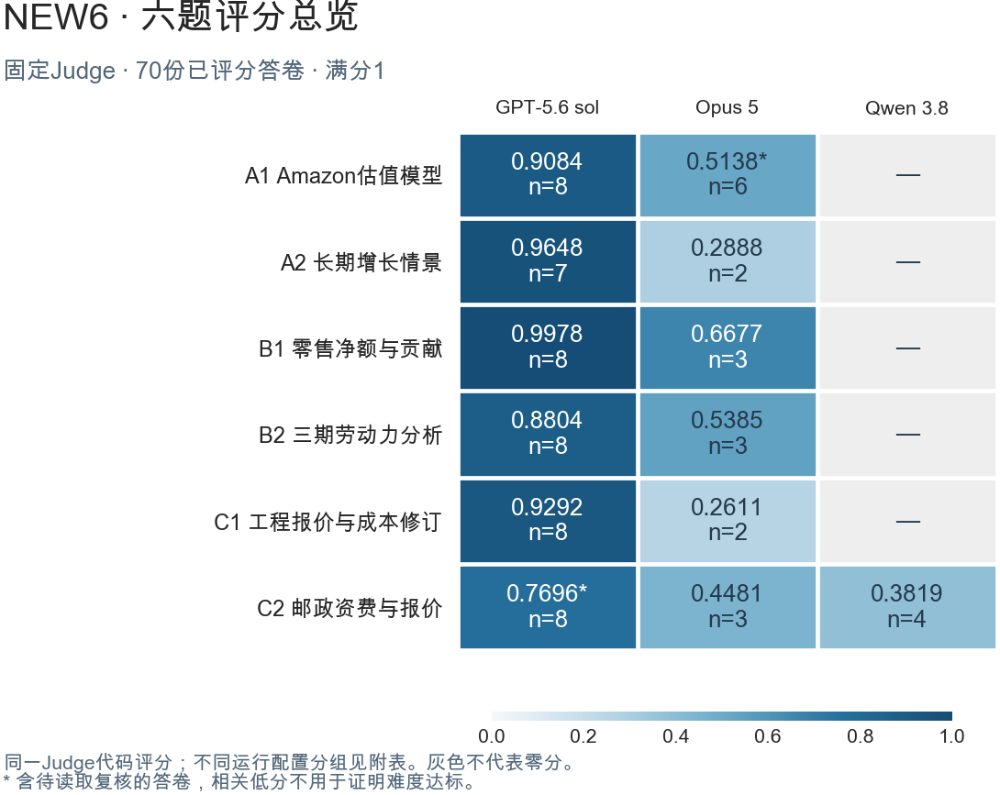

# NEW6 · 同一Judge的评分结果

默认采用60%重点能力、40%其余要求；满分1，通过阈值0.70。

| 任务 | GPT-5.6 sol | Opus 5 | Qwen 3.8 |
|---|---|---|---|
| A1 Amazon估值模型 | 0.9084（n=8） | 0.5138*（n=6） | — |
| A2 长期增长情景 | 0.9648（n=7） | 0.2888（n=2） | — |
| B1 零售净额与贡献 | 0.9978（n=8） | 0.6677（n=3） | — |
| B2 三期劳动力分析 | 0.8804（n=8） | 0.5385（n=3） | — |
| C1 工程报价与成本修订 | 0.9292（n=8） | 0.2611（n=2） | — |
| C2 邮政资费与报价 | 0.7696*（n=8） | 0.4481（n=3） | 0.3819（n=4） |

n为已评分答卷数；同一Judge，运行配置分组另列，正式难度验收仍待完成。

| 任务与系统 | 已评分中的通过次数 | Pass@1 | Pass@8 |
|---|---|---|---|
| A1 Opus 5 | 1/6 | — | — |
| A1 GPT-5.6 sol | 7/8 | 87.5% | 100.0% |
| A2 Opus 5 | 0/2 | — | — |
| A2 GPT-5.6 sol | 7/7 | — | — |
| B1 Opus 5 | 2/3 | — | — |
| B1 GPT-5.6 sol | 8/8 | 100.0% | 100.0% |
| B2 Opus 5 | 0/3 | — | — |
| B2 GPT-5.6 sol | 8/8 | 100.0% | 100.0% |
| C1 Opus 5 | 0/2 | — | — |
| C1 GPT-5.6 sol | 8/8 | 100.0% | 100.0% |
| C2 Opus 5 | 0/3 | — | — |
| C2 GPT-5.6 sol | 5/8 | 62.5% | 100.0% |
| C2 Qwen 3.8 | 0/4 | — | — |

这些是同配置组内的描述性指标。未完整判定的组不估算Pass@k；正式验收还需模型身份、替代确认和独立样本。完整配置见结果附件。

## 逐次成绩

| 任务 | 系统与试次 | 分数 | 是否通过 |
|---|---|---|---|
| A1 | Opus 5 R01 | 0.8566 | 通过 |
| A1 | Opus 5 R02 | 0.5908 | 未通过 |
| A1 | Opus 5 R03 | 0.2980 | 未通过 |
| A1 | Opus 5 R06 | 0.5497 | 未通过 |
| A1 | Opus 5 R07 | 0.3390 | 未通过 |
| A1 | Opus 5 R08 | 0.4489 | 未通过 |
| A1 | GPT-5.6 sol R01 | 0.9492 | 通过 |
| A1 | GPT-5.6 sol R02 | 0.9492 | 通过 |
| A1 | GPT-5.6 sol R03 | 0.9492 | 通过 |
| A1 | GPT-5.6 sol R04 | 0.5526 | 未通过 |
| A1 | GPT-5.6 sol R05 | 0.9403 | 通过 |
| A1 | GPT-5.6 sol R06 | 0.9938 | 通过 |
| A1 | GPT-5.6 sol R07 | 1.0000 | 通过 |
| A1 | GPT-5.6 sol R08 | 0.9330 | 通过 |
| A2 | Opus 5 R01 | 0.2680 | 未通过 |
| A2 | Opus 5 R02 | 0.3095 | 未通过 |
| A2 | GPT-5.6 sol R02 | 1.0000 | 通过 |
| A2 | GPT-5.6 sol R03 | 0.8792 | 通过 |
| A2 | GPT-5.6 sol R04 | 1.0000 | 通过 |
| A2 | GPT-5.6 sol R05 | 1.0000 | 通过 |
| A2 | GPT-5.6 sol R06 | 0.8792 | 通过 |
| A2 | GPT-5.6 sol R07 | 1.0000 | 通过 |
| A2 | GPT-5.6 sol R08 | 0.9952 | 通过 |
| B1 | Opus 5 R06 | 0.7405 | 通过 |
| B1 | Opus 5 R07 | 0.7630 | 通过 |
| B1 | Opus 5 R08 | 0.4997 | 未通过 |
| B1 | GPT-5.6 sol R01 | 0.9985 | 通过 |
| B1 | GPT-5.6 sol R02 | 1.0000 | 通过 |
| B1 | GPT-5.6 sol R03 | 0.9953 | 通过 |
| B1 | GPT-5.6 sol R04 | 0.9991 | 通过 |
| B1 | GPT-5.6 sol R05 | 1.0000 | 通过 |
| B1 | GPT-5.6 sol R06 | 1.0000 | 通过 |
| B1 | GPT-5.6 sol R07 | 0.9923 | 通过 |
| B1 | GPT-5.6 sol R08 | 0.9972 | 通过 |
| B2 | Opus 5 R03 | 0.5751 | 未通过 |
| B2 | Opus 5 R05 | 0.4564 | 未通过 |
| B2 | Opus 5 R07 | 0.5839 | 未通过 |
| B2 | GPT-5.6 sol R01 | 0.8085 | 通过 |
| B2 | GPT-5.6 sol R02 | 0.8459 | 通过 |
| B2 | GPT-5.6 sol R03 | 0.9182 | 通过 |
| B2 | GPT-5.6 sol R04 | 0.8878 | 通过 |
| B2 | GPT-5.6 sol R05 | 0.8798 | 通过 |
| B2 | GPT-5.6 sol R06 | 0.8238 | 通过 |
| B2 | GPT-5.6 sol R07 | 0.9497 | 通过 |
| B2 | GPT-5.6 sol R08 | 0.9295 | 通过 |
| C1 | Opus 5 R03 | 0.2542 | 未通过 |
| C1 | Opus 5 R08 | 0.2680 | 未通过 |
| C1 | GPT-5.6 sol R01 | 0.9144 | 通过 |
| C1 | GPT-5.6 sol R02 | 0.9013 | 通过 |
| C1 | GPT-5.6 sol R03 | 0.9317 | 通过 |
| C1 | GPT-5.6 sol R04 | 0.8616 | 通过 |
| C1 | GPT-5.6 sol R05 | 0.9348 | 通过 |
| C1 | GPT-5.6 sol R06 | 0.9926 | 通过 |
| C1 | GPT-5.6 sol R07 | 0.9478 | 通过 |
| C1 | GPT-5.6 sol R08 | 0.9492 | 通过 |
| C2 | Opus 5 R02 | 0.5113 | 未通过 |
| C2 | Opus 5 R06 | 0.4342 | 未通过 |
| C2 | Opus 5 R08 | 0.3988 | 未通过 |
| C2 | GPT-5.6 sol R01 | 1.0000 | 通过 |
| C2 | GPT-5.6 sol R02 | 0.3113 | 未通过 |
| C2 | GPT-5.6 sol R03 | 0.9988 | 通过 |
| C2 | GPT-5.6 sol R04 | 1.0000 | 通过 |
| C2 | GPT-5.6 sol R05 | 1.0000 | 通过 |
| C2 | GPT-5.6 sol R06 | 0.6639 | 未通过 |
| C2 | GPT-5.6 sol R07 | 1.0000 | 通过 |
| C2 | GPT-5.6 sol R08 | 0.1827 | 未通过 |
| C2 | Qwen 3.8 R03 | 0.3077 | 未通过 |
| C2 | Qwen 3.8 R05 | 0.3278 | 未通过 |
| C2 | Qwen 3.8 R06 | 0.3325 | 未通过 |
| C2 | Qwen 3.8 R08 | 0.5595 | 未通过 |

## 离线重算与完整证据

在本目录运行 `python3 recompute.py` 可从保存的逐项信用重新生成逐次表、均分与配置分组。该命令只算分项算术，不读取Excel；重新读取已有答卷请使用[完整复跑入口](../README.md)。

[原分/50%/60%逐次表](trials.csv) · [配置分组与Pass指标](stratified_summary.csv) · [精确权重](weights.csv) · [同一答卷5次评分](consistency.json) · [读取风险](LOW_SCORE_NOTES.md) · [来源与适用性](SOURCE_NOTES.md)

当前Judge中A1 Opus R03、C2 GPT R02/R08存在读取风险，带星号的均分包含这些回执，相关低分不得直接作为难度合格证据。Qwen C2本版4份可评分、2份待判；其他版本曾给出的高分仍保留在[版本事实附件](other_version_facts.json)，不混入本版均分。
