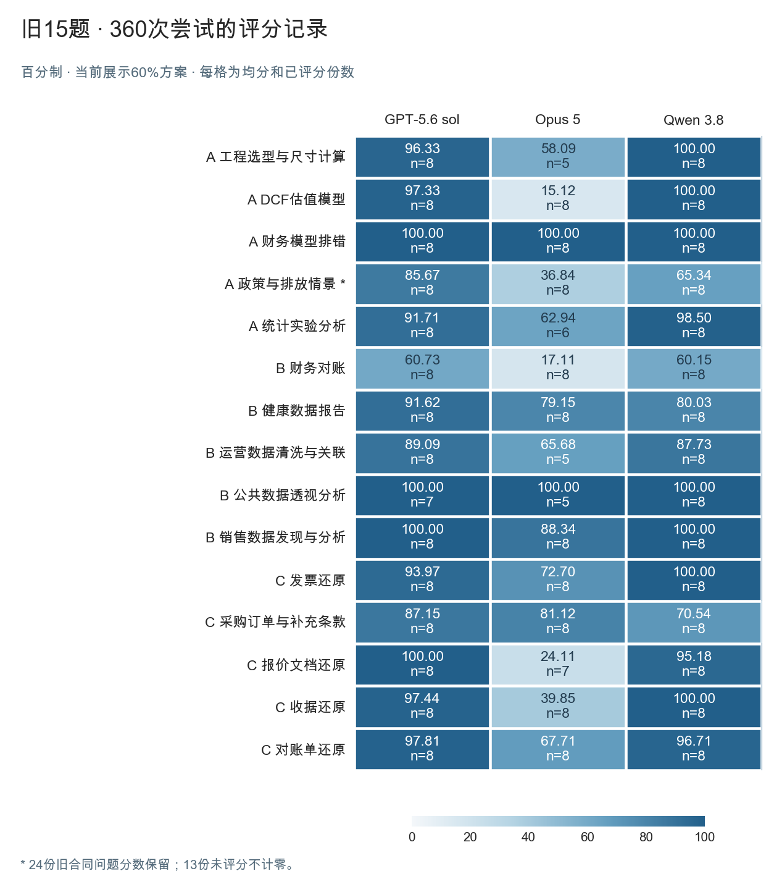
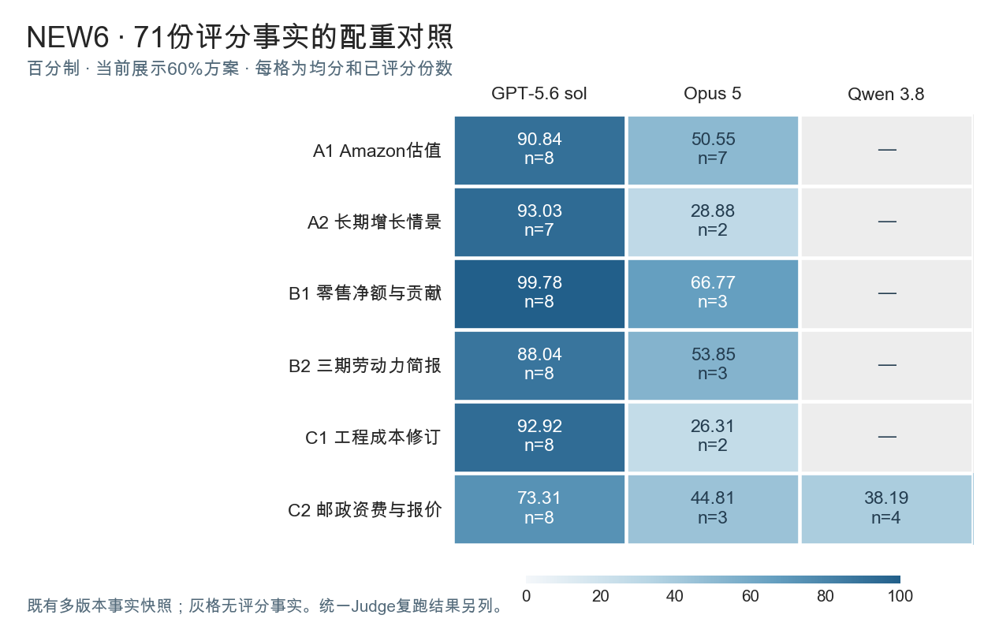

# 旧15题与NEW6的逐题配重对照

本表采用指定评分事实快照，比较原配重与重点能力占50%、60%、70%时的分数。每档复用同一份答卷的既有分项信用，没有重新生成答案，也没有重新运行Judge。正文展示60%方案，四档完整结果放在下方附件。

旧15题是15道任务、3个系统、每组8次，共360次尝试。347份有分数，包括24份带旧合同问题标记的政策与排放题答卷。其余13份未进入均分。NEW6使用71份已有分项记录，各系统覆盖不同，Qwen只有C2；总均分用于描述已评分记录，不作完整六题排名。

NEW6这份71份快照汇集不同读取版本的回执，与已发布的70份固定Judge复跑结果分开保留。二者有一份评分状态和四份分项结果不同，见[版本与差异说明](SOURCE_NOTES.md)。本轮选择的是用户指定的快照对照，不把它标成统一Judge的新成绩。

## 旧15题的逐题成绩

满分100，每格为均分与已评分份数。

| 任务 | GPT-5.6 sol | Opus 5 | Qwen 3.8 |
|---|---|---|---|
| A 工程选型与尺寸计算 | 96.33（8份） | 58.09（5份） | 100.00（8份） |
| A DCF估值模型 | 97.33（8份） | 15.12（8份） | 100.00（8份） |
| A 财务模型排错 | 100.00（8份） | 100.00（8份） | 100.00（8份） |
| A 政策与排放情景 * | 85.67（8份） | 36.84（8份） | 65.34（8份） |
| A 统计实验分析 | 91.71（8份） | 62.94（6份） | 98.50（8份） |
| B 财务对账 | 60.73（8份） | 17.11（8份） | 60.15（8份） |
| B 健康数据报告 | 91.62（8份） | 79.15（8份） | 80.03（8份） |
| B 运营数据清洗与关联 | 89.09（8份） | 65.68（5份） | 87.73（8份） |
| B 公共数据透视分析 | 100.00（7份） | 100.00（5份） | 100.00（8份） |
| B 销售数据发现与分析 | 100.00（8份） | 88.34（8份） | 100.00（8份） |
| C 发票还原 | 93.97（8份） | 72.70（8份） | 100.00（8份） |
| C 采购订单与补充条款 | 87.15（8份） | 81.12（8份） | 70.54（8份） |
| C 报价文档还原 | 100.00（8份） | 24.11（7份） | 95.18（8份） |
| C 收据还原 | 97.44（8份） | 39.85（8份） | 100.00（8份） |
| C 对账单还原 | 97.81（8份） | 67.71（8份） | 96.71（8份） |



政策与排放题的24份分数均保留，来源单位与基线不一致问题尚在。它们用于诊断，不能当作修正合同后的验收成绩。

| 任务 | 系统 | 份数 | 未进入均分的原因 |
|---|---|---|---|
| 工程选型与尺寸计算 | Opus 5 | 3 | 结果字段缺失或无法唯一识别 |
| 统计实验分析 | Opus 5 | 2 | 公式重算或结果识别失败 |
| 运营数据清洗与关联 | Opus 5 | 3 | 工作表或结果区域未可靠识别 |
| 报价文档还原 | Opus 5 | 1 | 最终结果区域未可靠识别 |
| 公共数据透视分析 | GPT-5.6 sol / Opus 5 | 1份／3份 | 需要原生Excel验证刷新与重算 |

## NEW6的逐题成绩

| 任务 | GPT-5.6 sol | Opus 5 | Qwen 3.8 |
|---|---|---|---|
| A1 Amazon估值 | 90.84（8份） | 50.55（7份） | — |
| A2 长期增长情景 | 93.03（7份） | 28.88（2份） | — |
| B1 零售净额与贡献 | 99.78（8份） | 66.77（3份） | — |
| B2 三期劳动力简报 | 88.04（8份） | 53.85（3份） | — |
| C1 工程成本修订 | 92.92（8份） | 26.31（2份） | — |
| C2 邮政资费与报价 | 73.31（8份） | 44.81（3份） | 38.19（4份） |



横轴始终按GPT-5.6 sol、Opus 5、Qwen 3.8排列；颜色越深分数越高，灰色表示该快照无评分事实。两张图均使用0—100刻度。

## 各系统的四档总均分

| 范围 | 系统 | 有分数份数 | 原分 | 50% | 60% | 70% |
|---|---|---|---|---|---|---|
| 旧15题 | GPT-5.6 sol | 119 | 92.80 | 92.72 | 92.53 | 92.34 |
| 旧15题 | Opus 5 | 108 | 61.31 | 60.04 | 59.71 | 59.38 |
| 旧15题 | Qwen 3.8 | 120 | 91.02 | 90.76 | 90.28 | 89.79 |
| NEW6 | GPT-5.6 sol | 47 | 90.32 | 89.87 | 89.58 | 89.29 |
| NEW6 | Opus 5 | 20 | 53.49 | 50.16 | 48.03 | 45.89 |
| NEW6 | Qwen 3.8 | 4 | 50.69 | 43.19 | 38.19 | 33.19 |

总均分按每份有分数答卷等权计算，不是先求逐题均分再平均。旧15题分母为119、108、120；NEW6为47、20、4。未知状态不补零。

## 这些结果支持哪些筛选判断

在所列21题及四档方案中，财务对账在70%方案下三个系统均分均低于60，每组8份；NEW6 C2在50%、60%、70%下均有两个系统低于60，但Opus 5与Qwen 3.8仅3份和4份。按“至少两个系统均分低于60”的初筛，现有记录支持这两道候选，尚未支持六道。

财务模型排错和公共数据透视分析的已评分记录均为满分，重配权重不会改变满分；后者另有4份待原生验证。NEW6 B1的Opus 5从原分56.75升至70%方案的70.78，说明加大选定能力的权重未必降低分数。

初筛只检查均分。完整难度要求还包括逐题Pass@8、可比模型及配置、独立验收；这些事实快照未统一提供足够的Judge和配置身份，因此不据此填正式Pass@1或Pass@8。

[查看四档逐题对照表](COMPARISON.md)

## 下载与复算

[四档逐题均分与分母CSV](scores_by_task_model.csv) · [全部431条尝试/评分记录](trials.csv) · [24份旧合同问题分数](legacy_contract_24_scores.csv) · [能力分组与精确配重](profiles.json) · [既有分项事实](frozen_facts.json)

下面只复算已保存事实的加权分数，不打开Excel、不调用模型。重新评分原答卷请用[固定Judge复跑入口](../../repro/README.md)。

```bash
git clone https://github.com/alex051107/new6-judge-review-20260905.git
cd new6-judge-review-20260905
git checkout p15-new6-ability-comparison-20260906-v1
cd results/ability-comparison-360-v1
python3 recompute.py
```

P15方案把文件可用性固定为2分，重点组占所选50/60/70分，其余正项分配剩余48/38/28分；既有负项按原正项总分归一化后保持比例，没有新增处罚或加重处罚。NEW6其余组占50/40/30分，无新增负项。分项在各组内保留原相对权重；部分信用沿用既有事实分母，最终分数限制在0—100。通过阈值始终为未舍入70分。

CSV中的mean保留原始0—1存储值，mean_percent为正文使用的百分制均分；trials.csv四档逐次分数使用百分制。复算脚本生成原始尺度的分数与汇总。
