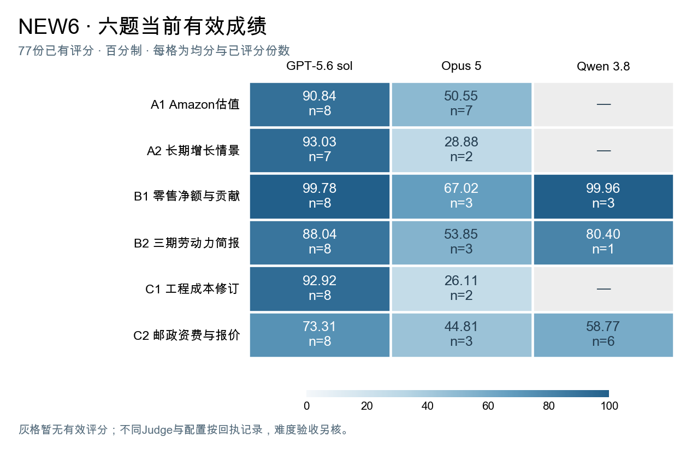

# 各题当前有效回执

本表汇总77份已有有效评分，满分100；括号是已评分答卷数，也是均分分母。默认配重将60分用于各题的后续使用与分析关系，40分用于当前结果、规则与交付核验；具体业务项见判分依据与权重说明。各项保留原有事实与部分信用。

每条先采用当前声明Judge的成功回执；当前待判时，仅复用同一trial与原件哈希的已验证成功回执。选择顺序不比较分数大小。

| 题 | GPT-5.6 sol | Opus 5 | Qwen 3.8 |
|---|---:|---:|---:|
| A1 | 90.84（n=8） | 50.55（n=7） | —（n=0） |
| A2 | 93.03（n=7） | 28.88（n=2） | —（n=0） |
| B1 | 99.78（n=8） | 67.02（n=3） | 99.96（n=3） |
| B2 | 88.04（n=8） | 53.85（n=3） | 80.40（n=1） |
| C1 | 92.92（n=8） | 26.11（n=2） | —（n=0） |
| C2 | 73.31（n=8） | 44.81（n=3） | 58.77（n=6） |

144个任务槽位中，77份已有评分，29份Judge待判、27份运行或收集待完成、11份缺输出。后三类均未补零。经运行日志单独核实的6份Opus 5答卷正常结束但没有交付文件；其文字中出现未执行的工具调用，不能据此将失败全部归因于业务能力。

该浏览表包含不同Judge和生成配置，不能作为同版模型难度验收。

[原/50/60/70及n与通过次数](summary.csv) · [Judge与配置分层](stratified_summary.csv) · [逐次记录](trials.csv) · [事实摘录](source_records.json) · [权重](weights.json) · [选择与身份说明](SOURCE_NOTES.md)



图中颜色仅编码已评分均分，灰色表示没有有效分数；不表示零分。每题按A1至C2排列，统一使用0—100色标。

## 离线配重复算

在本目录执行以下实际入口，仅需 Python 3 标准库：

```bash
python3 recompute.py --output-dir recomputed
```

脚本读取公开的分项事实与权重，重建原权重、重点50%、60%、70%的逐次分数和汇总，并与当前发布表逐项核对。输出位于 `recomputed/trials.csv`、`recomputed/summary.csv` 与 `recomputed/validation.json`。这是配重复算，不重新读取 Excel、不运行 Judge、不调用模型。已本地验证144条记录与18个题目×系统汇总完全匹配；77条有分、67条未知保持空值。
