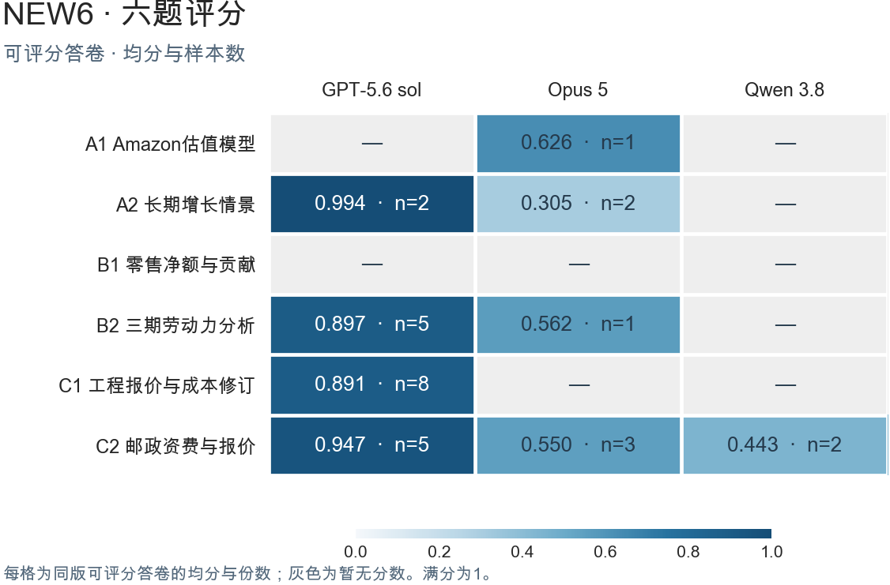

# NEW6 六题评分

各题按业务关系、核对证据及后续使用要求评分。满分1，未舍入分数达到0.70通过；配重与来源见方法附件。

| 任务 | GPT-5.6 sol | Opus 5 | Qwen 3.8 |
|---|---|---|---|
| A1 Amazon估值模型 | — | 0.6259（n=1） | — |
| A2 长期增长情景 | 0.9940（n=2） | 0.3048（n=2） | — |
| B1 零售净额与贡献 | — | — | — |
| B2 三期劳动力分析 | 0.8968（n=5） | 0.5616（n=1） | — |
| C1 工程报价与成本修订 | 0.8912（n=8） | — | — |
| C2 邮政资费与报价 | 0.9465（n=5） | 0.5495（n=3） | 0.4427（n=2） |

n为同版已评分答卷数。

| 任务 | 系统 | 已评分n | 均分 | Pass@1 | Pass@8 |
|---|---|---|---|---|---|
| A1 | Opus 5 | 1 | 0.6259 | — | — |
| A2 | Opus 5 | 2 | 0.3048 | — | — |
| A2 | GPT-5.6 sol | 2 | 0.9940 | — | — |
| B2 | Opus 5 | 1 | 0.5616 | — | — |
| B2 | GPT-5.6 sol | 5 | 0.8968 | — | — |
| C1 | GPT-5.6 sol | 8 | 0.8912 | 100.0% | 100.0% |
| C2 | Opus 5 | 3 | 0.5495 | — | — |
| C2 | GPT-5.6 sol | 5 | 0.9465 | — | — |
| C2 | Qwen 3.8 | 2 | 0.4427 | — | — |

## 逐次成绩

| 任务 | 系统与试次 | 分数 | 是否通过 |
|---|---|---|---|
| A1 | Opus 5 R02 | 0.6259 | 未通过 |
| A2 | Opus 5 R01 | 0.2876 | 未通过 |
| A2 | Opus 5 R02 | 0.3219 | 未通过 |
| A2 | GPT-5.6 sol R02 | 1.0000 | 通过 |
| A2 | GPT-5.6 sol R08 | 0.9880 | 通过 |
| B2 | Opus 5 R07 | 0.5616 | 未通过 |
| B2 | GPT-5.6 sol R01 | 0.8356 | 通过 |
| B2 | GPT-5.6 sol R05 | 0.8761 | 通过 |
| B2 | GPT-5.6 sol R06 | 0.8972 | 通过 |
| B2 | GPT-5.6 sol R07 | 0.9501 | 通过 |
| B2 | GPT-5.6 sol R08 | 0.9251 | 通过 |
| C1 | GPT-5.6 sol R01 | 0.8557 | 通过 |
| C1 | GPT-5.6 sol R02 | 0.8855 | 通过 |
| C1 | GPT-5.6 sol R03 | 0.9076 | 通过 |
| C1 | GPT-5.6 sol R04 | 0.7920 | 通过 |
| C1 | GPT-5.6 sol R05 | 0.8863 | 通过 |
| C1 | GPT-5.6 sol R06 | 0.9863 | 通过 |
| C1 | GPT-5.6 sol R07 | 0.9030 | 通过 |
| C1 | GPT-5.6 sol R08 | 0.9130 | 通过 |
| C2 | Opus 5 R02 | 0.5929 | 未通过 |
| C2 | Opus 5 R06 | 0.5250 | 未通过 |
| C2 | Opus 5 R08 | 0.5308 | 未通过 |
| C2 | GPT-5.6 sol R01 | 1.0000 | 通过 |
| C2 | GPT-5.6 sol R03 | 0.9974 | 通过 |
| C2 | GPT-5.6 sol R04 | 1.0000 | 通过 |
| C2 | GPT-5.6 sol R05 | 1.0000 | 通过 |
| C2 | GPT-5.6 sol R06 | 0.7351 | 通过 |
| C2 | Qwen 3.8 R05 | 0.4375 | 未通过 |
| C2 | Qwen 3.8 R06 | 0.4478 | 未通过 |

## 统计与复算

均分只描述表中同版已评分子集，n为分母。未交付和待判未被补成0分。Pass@k按1−C(n−c,k)/C(n,k)计算；不完整同配置组留空。本表C1的GPT组八次完整，其余组尚缺完整同版判定。Qwen身份和最新Qwen3独立验收待确认。

[逐次机器可读表](results/trials.csv) · [按配置分组](results/task_system_config.csv) · [独立重算命令](RECOMPUTE.md) · [具体配重](weights.json) · [来源与样本边界](SOURCE_NOTES.md) · [其他比例对照](sensitivity.csv)

外发要求每题至少两个指定系统分别同时满足均分低于0.6与Pass@8低于70%。当前逐题完整证据不足，保持待验收。已准备[逐题人工审查表](../../review/README.md)，尚无人审签字。
